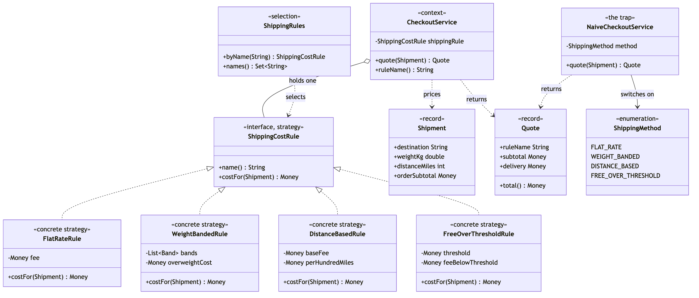

# Strategy Pattern

Demonstrates the Behavioural **Strategy** design pattern using delivery
pricing at checkout as an example.

- `ShippingCostRule` — the strategy. One interface: `name()` returns a
  display name, `costFor(Shipment)` returns the delivery charge.
- `FlatRateRule` / `WeightBandedRule` / `DistanceBasedRule` /
  `FreeOverThresholdRule` — the concrete strategies. One pricing policy
  each: the same charge on everything, a band table by weight, a base fee
  plus so much per hundred miles, and free delivery over a threshold.
- `CheckoutService` — the context. Holds one `ShippingCostRule`, calls it
  exactly once per quote, and has no branch anywhere that depends on which
  rule it is holding.
- `Shipment` / `Quote` — records carrying the request and the answer.
  `Shipment` deliberately carries more than any single rule uses, so that a
  new rule never has to change the interface.
- `ShippingRules` — the selection point. Maps a configuration name onto the
  rule it selects, once, at the edge; an unknown name is rejected rather
  than defaulted.
- `NaiveCheckoutService` / `ShippingMethod` — the trap, kept for contrast.
  One method branching on an enum, with a `default` that silently ships for
  free the day a fifth constant is added.
- `ShippingCostDemo` — runnable entry point that prices the same three
  shipments under all four rules, swaps the rule at runtime, and shows an
  unknown rule name being refused.

## Run

```bash
./gradlew run
```

Which prints:

```text
Four rules, priced against the same three shipments.

Rule "flat" -> Flat rate
  Edinburgh, 0.4kg, 45 miles, order £18.00
    Flat rate: subtotal £18.00 + delivery £4.99 = £22.99
  Cardiff, 6.5kg, 180 miles, order £64.00
    Flat rate: subtotal £64.00 + delivery £4.99 = £68.99
  Inverness, 24.0kg, 560 miles, order £31.50
    Flat rate: subtotal £31.50 + delivery £4.99 = £36.49

Rule "weight" -> Weight banded
  Edinburgh, 0.4kg, 45 miles, order £18.00
    Weight banded: subtotal £18.00 + delivery £3.50 = £21.50
  Cardiff, 6.5kg, 180 miles, order £64.00
    Weight banded: subtotal £64.00 + delivery £12.00 = £76.00
  Inverness, 24.0kg, 560 miles, order £31.50
    Weight banded: subtotal £31.50 + delivery £25.00 = £56.50

Rule "distance" -> Distance based
  Edinburgh, 0.4kg, 45 miles, order £18.00
    Distance based: subtotal £18.00 + delivery £3.50 = £21.50
  Cardiff, 6.5kg, 180 miles, order £64.00
    Distance based: subtotal £64.00 + delivery £5.00 = £69.00
  Inverness, 24.0kg, 560 miles, order £31.50
    Distance based: subtotal £31.50 + delivery £11.00 = £42.50

Rule "campaign" -> Free over £50.00
  Edinburgh, 0.4kg, 45 miles, order £18.00
    Free over £50.00: subtotal £18.00 + delivery £4.99 = £22.99
  Cardiff, 6.5kg, 180 miles, order £64.00
    Free over £50.00: subtotal £64.00 + delivery FREE = £64.00
  Inverness, 24.0kg, 560 miles, order £31.50
    Free over £50.00: subtotal £31.50 + delivery £4.99 = £36.49

The client is the same object every time.
CheckoutService never asks which rule it is holding:
  flat           delivery £4.99
  weight         delivery £12.00
  distance       delivery £5.00
  campaign       delivery FREE

Swapping the rule at runtime changes the price, not the code:
  Weight banded: subtotal £18.00 + delivery £3.50 = £21.50
  Free over £50.00: subtotal £18.00 + delivery £4.99 = £22.99

An unknown rule name is refused, not defaulted:
  Rejected: no shipping rule called "second-class"; known rules are [flat, weight, distance, campaign]
```

## Test

```bash
./gradlew test
```

17 tests across 3 classes. `ShippingCostRuleTest` prices each rule in
isolation, in four `@Nested` groups — which is itself the point, since none
of these tests has to go through checkout or supply the fields its rule
does not read. `ShippingRulesTest` covers selection, including that an
unknown name is refused rather than defaulted. `CheckoutServiceTest` holds
the tests that actually prove the pattern was applied: a rule defined
entirely inside the test works unchanged, the rule is consulted exactly
once per quote, and every registered rule is substitutable for every other.

## Learning Material

Start here if you are new to the pattern — the docs are ordered as a
learning path.

| Document | What it covers |
| --- | --- |
| [`docs/prerequisites.md`](docs/prerequisites.md) | What to know and install before you start |
| [`docs/problem-statement.md`](docs/problem-statement.md) | The problem the pattern solves, and why the naive approach hurts |
| [`docs/strategy-pattern-explained.md`](docs/strategy-pattern-explained.md) | The pattern itself, the code walked through, pitfalls, and comparisons |
| [`docs/class-diagram.md`](docs/class-diagram.md) | Static structure |
| [`docs/uml-diagram.md`](docs/uml-diagram.md) | Runtime call flow |
| [`docs/animation.html`](docs/animation.html) | Animated, step-by-step walkthrough — open in a browser. Optional narration via the **Narration** button |
| [`docs/session.md`](docs/session.md) | A 60-minute guided session plan for teaching it |
| [`docs/youtube.md`](docs/youtube.md) | Title, description, chapters and thumbnail for publishing the video |
| [`docs/thumbnail.png`](docs/thumbnail.png) | The 1280×720 image to upload as the YouTube thumbnail |
| [`docs/spec.md`](docs/spec.md) | The project specification — problem, code, video and publishing quality bar. Also as [`spec.html`](docs/spec.html) |
| [`video/`](video/) | A narrated video, plus the script and build pipeline |

### The pattern in one picture



### Video

`video/strategy-pattern-explained.mp4` — 1080p, narrated. An audio-only
version is alongside it. See [`video/README.md`](video/README.md) to
rebuild or re-record it.

## Also available with a framework

[Strategy with Spring Pattern](../strategy-with-spring-pattern) reruns this idea on a real framework, and shows what the framework adds and where it can undo the pattern. Watch this project first.
