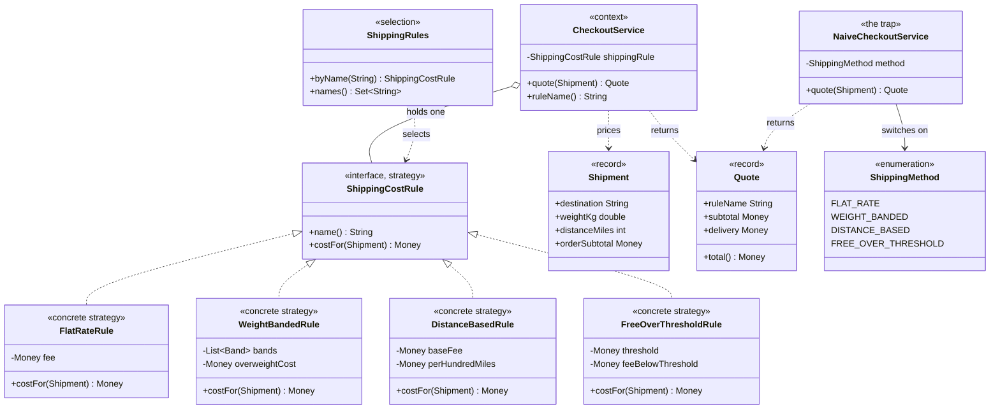

# Strategy Pattern — Class Diagram

Shows the static structure: `CheckoutService` holds one `ShippingCostRule`
and never learns which of the four implementations it is. `ShippingRules`
maps a configuration name onto a rule, once, at the edge. The naive
alternative — one method branching on a `ShippingMethod` enum — is drawn
alongside to show what the pattern buys you.

Mermaid source

## Notes

- `ShippingCostRule` is the **Strategy**: the one interface the context
  depends on. It has two methods, not one, so a rule can name itself for
  the receipt — otherwise the client would need a lookup table of display
  names, which is the branch coming back in disguise.
- `FlatRateRule`, `WeightBandedRule`, `DistanceBasedRule` and
  `FreeOverThresholdRule` are the **Concrete Strategies**. Each holds only
  the constants its own algorithm needs, and reads only the `Shipment`
  fields it cares about.
- `CheckoutService` is the **Context**. The association is drawn as
  aggregation because the rule is supplied from outside and outlives the
  service; the service does not create it and cannot replace it.
- `Shipment` carries more than any single rule uses. That is deliberate:
  if `costFor` took only a weight, adding a distance rule would change the
  interface and therefore every implementation.
- `ShippingRules` is where the last remaining branch lives. It runs once
  when the rule is chosen, not on every quote, and in a real store it would
  be a database table or a feature flag rather than code.
- `NaiveCheckoutService` and `ShippingMethod` share no supertype with any
  of it. Note that the enum is a dependency of the naive service *only* —
  nothing in the pattern side of the diagram touches it, which is the
  clearest single indication of what was removed.
