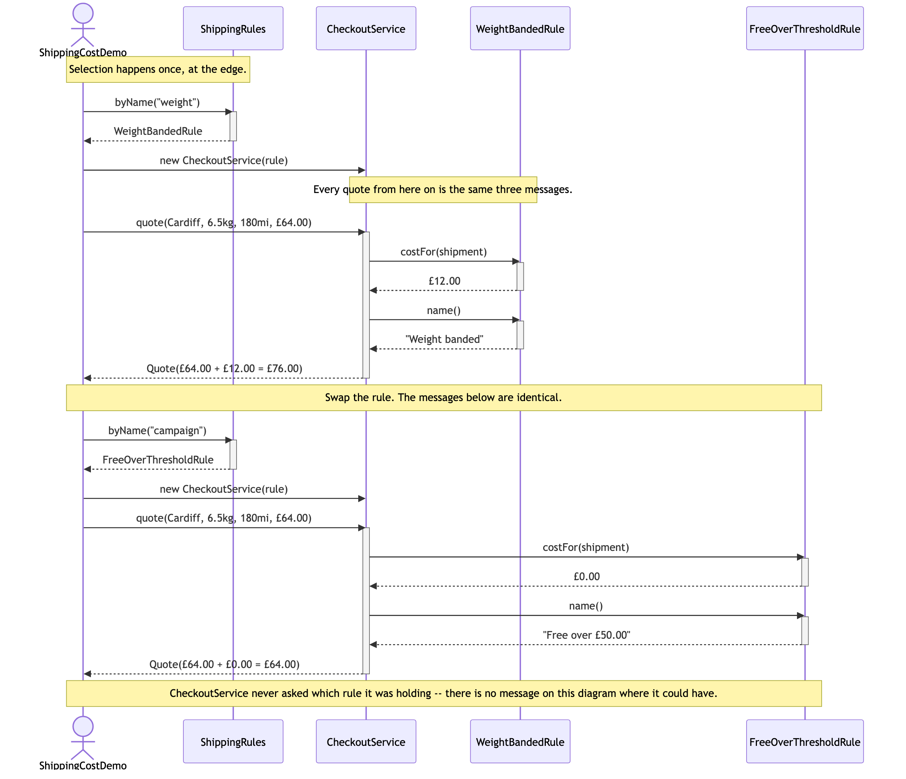
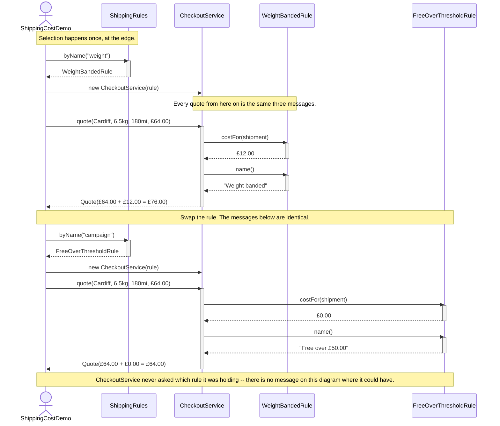

# Strategy Pattern — UML Sequence Diagram

Shows the runtime interaction: the rule is chosen once, before checkout
exists, and after that every quote is the same three messages regardless of
which rule was picked. The second half of the diagram repeats the identical
exchange with a different rule to make the point that nothing on the
`CheckoutService` side changes.

Mermaid source

## Notes

- **Selection is a separate episode from use.** The first two messages
  happen once, when the shop is configured; everything after that repeats
  per order. In the naive design those two concerns were the same line of
  code, executed on every quote.
- **`costFor` is called exactly once per quote.** That is asserted by a
  test, not just intended: a rule called twice would double-charge the day
  somebody writes one that is not free of side effects.
- **`name()` is a second message, not part of the price.** It exists so the
  receipt can say which rule applied without `CheckoutService` owning a
  table of display names — which would be the deleted `switch` growing back
  in a new place.
- **The two halves of the diagram are the same shape.** Different
  participant, different numbers, identical message sequence. If you
  covered the participant names you could not tell which rule was in force,
  and neither can `CheckoutService`.
- **Nothing returns to the rule.** `costFor` takes a `Shipment` and returns
  a `Money`; the rule holds no reference to the checkout and no state
  between calls, which is what lets one instance be shared by every
  concurrent order.
- Compare this with the Decorator project's sequence diagram: there, one
  call cascaded through a stack of objects that all implemented the same
  interface. Here there is exactly one implementation involved per quote.
  Same interface shape, entirely different runtime story — see
  [`strategy-pattern-explained.md`](strategy-pattern-explained.md).
