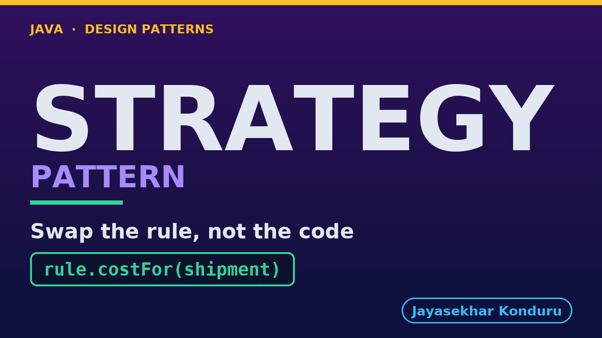

# YouTube — Strategy Pattern

Everything needed to publish `video/strategy-pattern-explained.mp4`. Copy the fields straight out of this file.

Chapter timings are generated from the video's `.srt`. Re-run `python3 docs/make_youtube_docs.py strategy` after any change to the narration, or they will be wrong.

## Title

```
Strategy Pattern in Java - Shipping Rules
```

41 characters — under the 60 YouTube shows before truncating in search results.

## Description

The first two lines are what a viewer sees above the fold, so they carry the hook rather than the boilerplate.

```
Learn the Strategy design pattern in Java 21 by pricing delivery for an online shop four different ways — a flat rate, weight bands, distance, and a free-over-fifty-pounds campaign. We start with the problem — one method with one switch over a shipping-method flag, growing a branch every time marketing invents a rule, and quietly shipping for free when it meets a value it does not recognise — and end with four tiny rule classes behind one interface, a checkout service that holds a rule without ever asking which one it is, and an honest look at where that switch actually went. No prior design-pattern knowledge needed. Full source code and written notes are in the repository.

CHAPTERS
00:00 Introduction
00:54 The Scenario
01:31 The Obvious First Move
01:56 The Naive Approach — Four Rules, One Method
02:39 Why That Hurts
03:15 The Strategy Pattern
03:36 Remember It With Getting Across Town
04:19 The Three Roles
05:03 The Strategy — One Small Interface
05:47 A Concrete Strategy — It Knows Only Its Own Arithmetic
06:19 The Context — Search It for the Word 'Weight'
07:27 The Test That Actually Proves It
08:02 Running It
08:37 Wrap Up
09:39 Thanks for Watching

SOURCE CODE, WRITTEN NOTES AND AN INTERACTIVE ANIMATION
https://github.com/jk-boot-up/java-design-patterns/tree/main/gradle-java/behavioural/strategy-pattern

WHAT YOU NEED FIRST
Java 21 and a working knowledge of classes and interfaces. No prior design-pattern knowledge is assumed. The full prerequisites are in docs/prerequisites.md in the repository.
```

## Chapters

YouTube renders these as chapters only if there are at least three and the first is at `00:00`.

```
00:00 Introduction
00:54 The Scenario
01:31 The Obvious First Move
01:56 The Naive Approach — Four Rules, One Method
02:39 Why That Hurts
03:15 The Strategy Pattern
03:36 Remember It With Getting Across Town
04:19 The Three Roles
05:03 The Strategy — One Small Interface
05:47 A Concrete Strategy — It Knows Only Its Own Arithmetic
06:19 The Context — Search It for the Word 'Weight'
07:27 The Test That Actually Proves It
08:02 Running It
08:37 Wrap Up
09:39 Thanks for Watching
```

## Tags

```
strategy pattern, interchangeable algorithms, shipping calculation, design patterns, java design patterns, gang of four, java 21, software design, clean code, object oriented design, java tutorial, ecommerce, programming tutorial
```

229 characters, under YouTube's 500 limit.

## Thumbnail



**Upload `docs/thumbnail.png`** — 1280×720, the size YouTube recommends, generated by `docs/make_thumbnails.py`. It is deliberately not the same image as the video's opening frame: a thumbnail is judged at about 360 pixels wide in a search result, so this one carries only the pattern name, one line of promise and one short piece of code, each set large enough to survive the shrink.

`video/poster.png` is the 1920×1080 opening frame, produced by the video build. It stays in the repository as the title card; it is not what gets uploaded.

YouTube will not pick the thumbnail up on its own — upload it under **Details → Thumbnail → Upload file**. A custom thumbnail requires a verified channel.

## Upload checklist

- [ ] Upload `video/strategy-pattern-explained.mp4` (1080p, H.264, 30 fps, AAC 48 kHz — already YouTube's recommended settings, no re-encode needed)
- [ ] Set the video language to **English** first, or the subtitle option may not appear
- [ ] Add subtitles: *Video elements → Add subtitles → Upload file → With timing* → `video/strategy-pattern-explained.srt`
- [ ] Upload `docs/thumbnail.png` as the thumbnail — do not let YouTube auto-pick a frame
- [ ] Paste the title, description and tags from above
- [ ] Add to the **Java Design Patterns** playlist, in learning order
- [ ] Wait for 1080p processing before sharing the link — code slides are unreadable at 360p

## Cards and end screen

End screen links to **Observer Pattern**, the next video in the learning order.

Add a card partway through pointing at the playlist, so a viewer who arrives at this pattern from search can find the rest of the series.

## Runtime

Approximately 10:06, narrated at 145 words per minute.
