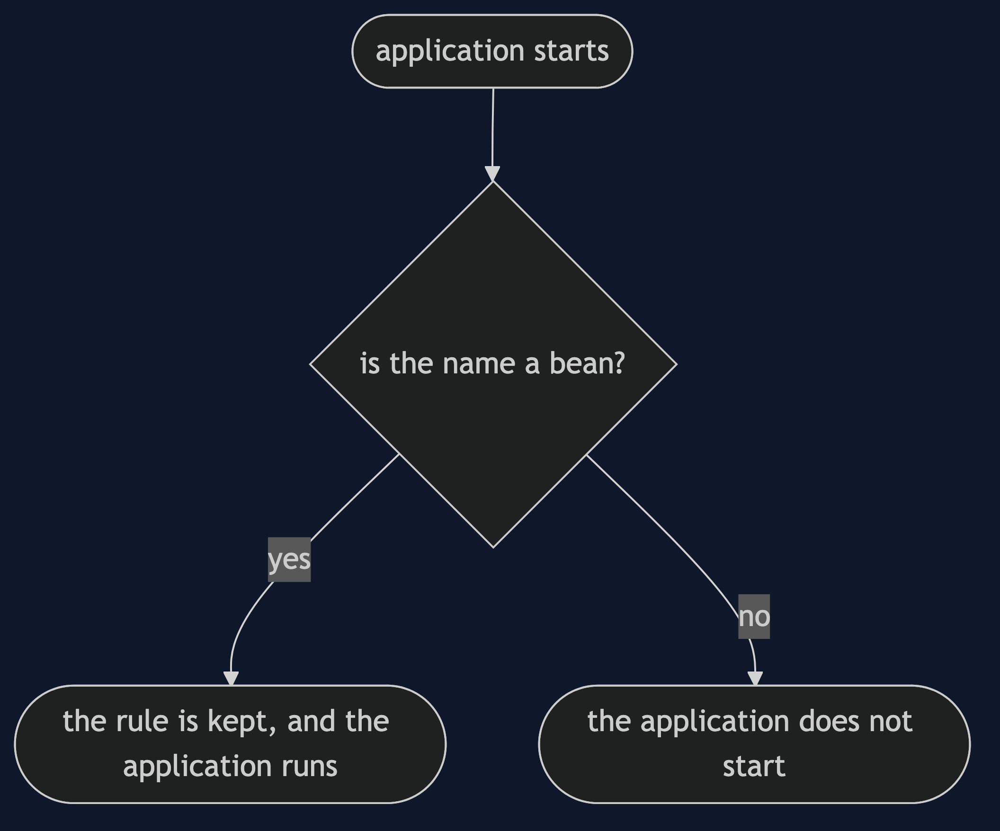
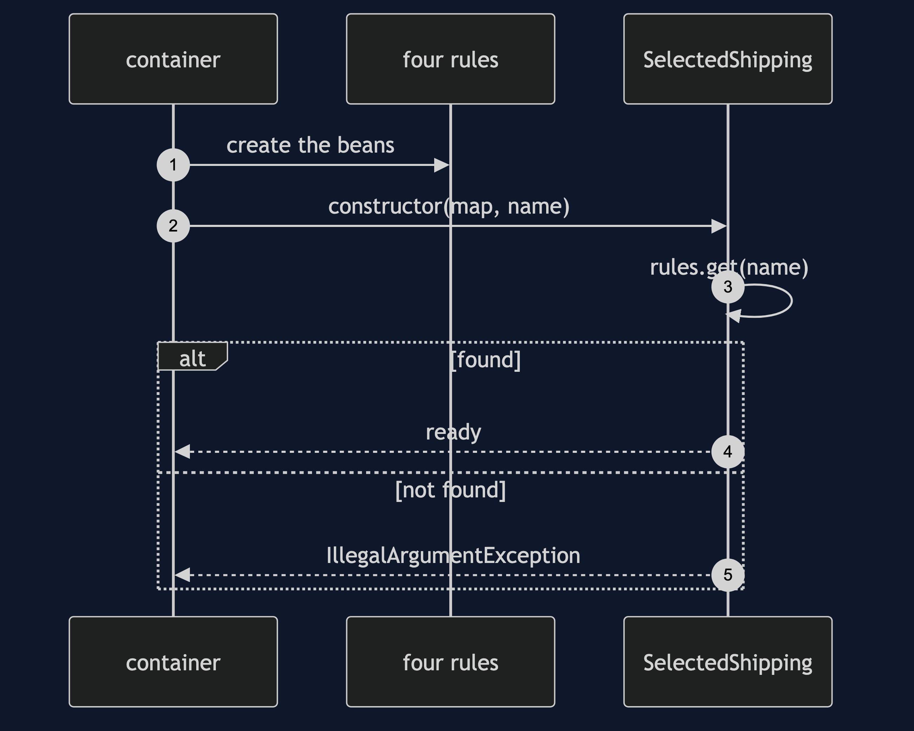
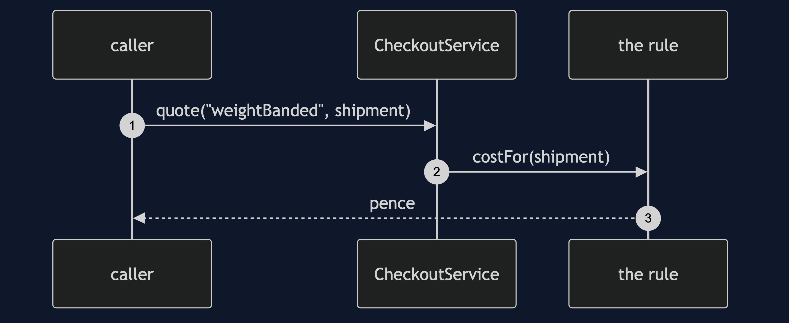
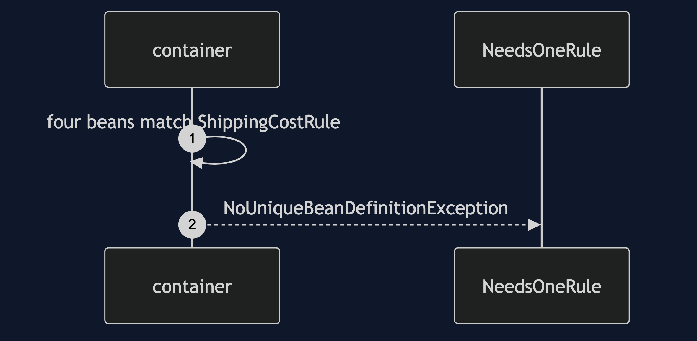

# Strategy with Spring Pattern

```
src/main/java/com/jk/explore/strategyspring/
├── ShippingApplication.java     the Spring Boot entry point and the six acts
├── ShippingCostRule.java        the strategy interface
├── FlatRateRule.java  WeightBandedRule.java  DistanceBasedRule.java  FreeOverThresholdRule.java
├── CheckoutService.java         the context: looks a rule up in the injected map
├── SelectedShipping.java        the rule chosen by configuration, checked at startup
├── ExpressRule.java             a fifth rule, registered by the demo
└── NeedsOneRule.java            asks for the interface alone
```

**In Spring the strategies are beans and the container keeps the table. The keys are bean names, and the container will not choose one for you.**

This project is the framework version of [Strategy](../strategy-pattern). That project built the mechanism by hand. This one shows the same idea inside Spring Boot. It does not re-teach the pattern. It shows what Spring Boot adds, the failures that are its own, and what it costs.

## Run

```bash
./gradlew run
```

Six acts. The partner project, Strategy, built the mechanism by hand. Here the same idea runs through Spring Boot, and every count comes from real output.

```
ONE. Spring finds the strategies.
  rules found: [distance, flat, freeOverThreshold, weightBanded].
  the keys are bean names, chosen in the @Component annotations.
TWO. The same shipments, every rule.
  distance           light 2.99  middle 3.49  heavy 4.99
  flat               light 4.99  middle 4.99  heavy 4.99
  freeOverThreshold  light 4.99  middle 4.99  heavy 0.00
  weightBanded       light 2.99  middle 4.99  heavy 8.99
  a name at run time that is unknown: unknown shipping rule 'teleport'; known: [distance, flat, freeOverThreshold, weightBanded]
THREE. Configuration chooses.
  shipping.rule=distance: the heavy shipment costs 4.99.
  shipping.rule=teleport: the application does not start. shipping.rule is 'teleport' but the rules are [distance, flat, freeOverThreshold, weightBanded]
FOUR. Four beans, one interface.
  a class that asks for a single ShippingCostRule: expected a single bean but found 4.
FIVE. A fifth rule.
  rules found: [distance, express, flat, freeOverThreshold, weightBanded].
  express quotes the heavy shipment at 9.99. CheckoutService did not change.
SIX. A default when nobody chooses.
  with the flat rule marked primary, the same class starts, and prices the heavy shipment at 4.99.
  the map still holds all four: [distance, flat, freeOverThreshold, weightBanded].
```

## Test

```bash
./gradlew test
```

2 test classes, 9 test methods, offline, with each Spring context started inside the test, and no server.

## Technologies and versions

| What | Version | Why it is here |
| --- | --- | --- |
| Java | 21 | The repository standard, via the Gradle toolchain block |
| Gradle | 9.2.1 | The wrapper in this directory; no separate install needed |
| Spring Boot | 4.1.1 | The container and its injection of maps |
| JUnit 5 | 5.10.2 | Test runner |

See [`docs/dependencies.md`](docs/dependencies.md).

## Learning Material

| Document | What it covers |
| --- | --- |
| [`docs/problem-statement.md`](docs/problem-statement.md) | The partner's four rules, and what is new |
| [`docs/strategy-with-spring-pattern-explained.md`](docs/strategy-with-spring-pattern-explained.md) | A map the container builds |
| [`docs/class-diagram.md`](docs/class-diagram.md) | The types |
| [`docs/architecture-diagram.md`](docs/architecture-diagram.md) | Configuration, container and checkout |
| [`docs/data-flow-diagram.md`](docs/data-flow-diagram.md) | How a rule is chosen |
| [`docs/sequence-diagram.md`](docs/sequence-diagram.md) | Written for a listener with the screen off |
| [`docs/uml-diagram.md`](docs/uml-diagram.md) | Four sequences |
| [`docs/animation.html`](docs/animation.html) | The six acts in a browser |
| [`docs/prerequisites.md`](docs/prerequisites.md) | What you need to know |
| [`docs/session.md`](docs/session.md) | A one-hour taught session |
| [`docs/spec.md`](docs/spec.md) | The generated specification |
| [`docs/youtube.md`](docs/youtube.md) | Title, description and chapters |
| [`docs/dependencies.md`](docs/dependencies.md) | What Spring Boot is, what it costs, and that skipping this project loses none of the pattern |

### The pattern in one picture


### Where each piece sits


### How one request moves



### Who calls whom, in order



### All four sequences






### Video

Built from [`video/scenes.py`](video/scenes.py) by
[`video/build_video.sh`](video/build_video.sh). The rendered file is not
committed; see the repository README for why.

## Where you have already met this

Payment providers, message handlers, and export formats chosen by a name.

## When this is too much

Two rules that never change need no container. A plain conditional is easier to read.

## Where this sits

This project pairs with [Strategy](../strategy-pattern), and is a framework version in [`behavioural`](..).
