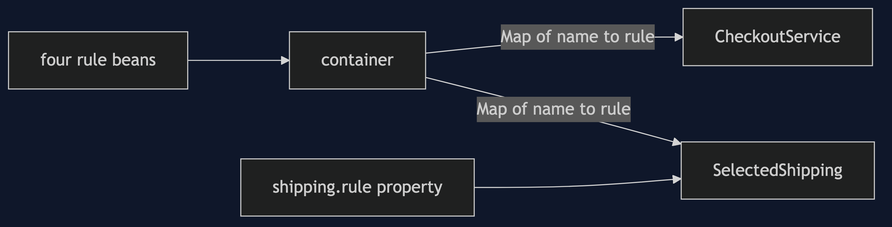
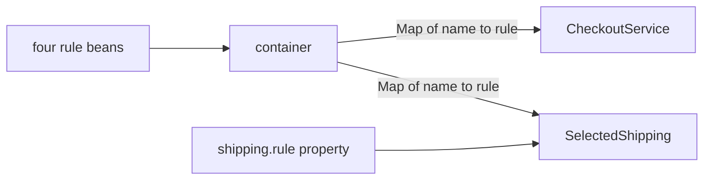

# Strategy with Spring Pattern — Architecture Diagram

The container gathers the rules into a map. Checkout and the configured choice read from it.

Mermaid source

```mermaid
flowchart LR
    B["four rule beans"] --> C["container"]
    C -->|Map of name to rule| K["CheckoutService"]
    C -->|Map of name to rule| S["SelectedShipping"]
    P["shipping.rule property"] --> S
```

