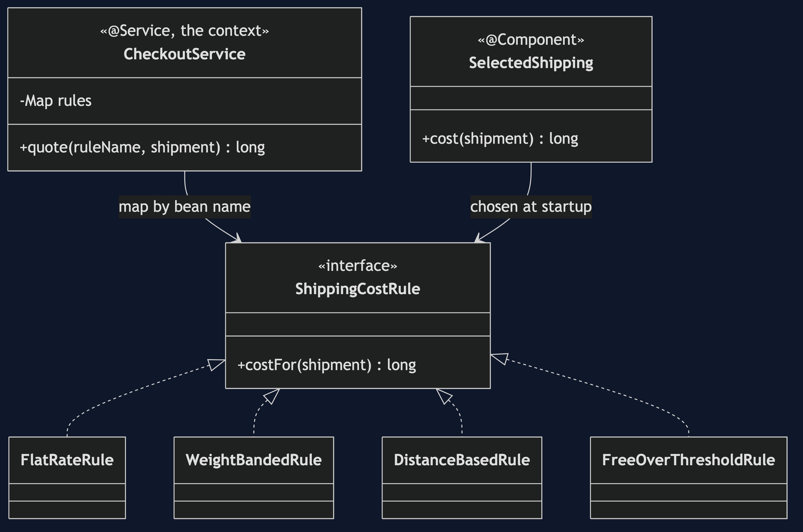
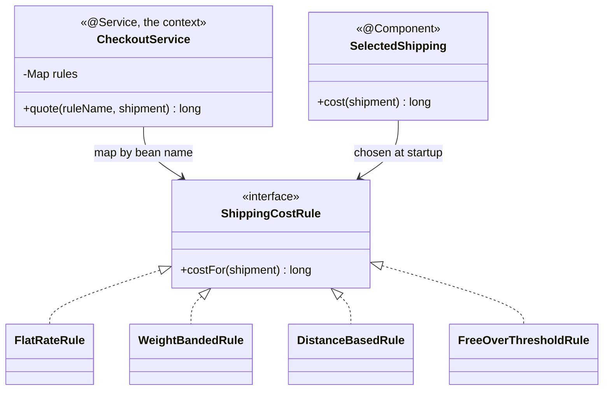

# Strategy with Spring Pattern — Class Diagram

The strategies are ordinary beans. The checkout receives all of them as one map.

Mermaid source

```mermaid
classDiagram
    class ShippingCostRule {
        <<interface>>
        +costFor(shipment) long
    }
    class FlatRateRule
    class WeightBandedRule
    class DistanceBasedRule
    class FreeOverThresholdRule
    class CheckoutService {
        <<@Service, the context>>
        -Map rules
        +quote(ruleName, shipment) long
    }
    class SelectedShipping {
        <<@Component>>
        +cost(shipment) long
    }
    ShippingCostRule <|.. FlatRateRule
    ShippingCostRule <|.. WeightBandedRule
    ShippingCostRule <|.. DistanceBasedRule
    ShippingCostRule <|.. FreeOverThresholdRule
    CheckoutService --> ShippingCostRule : map by bean name
    SelectedShipping --> ShippingCostRule : chosen at startup
```

