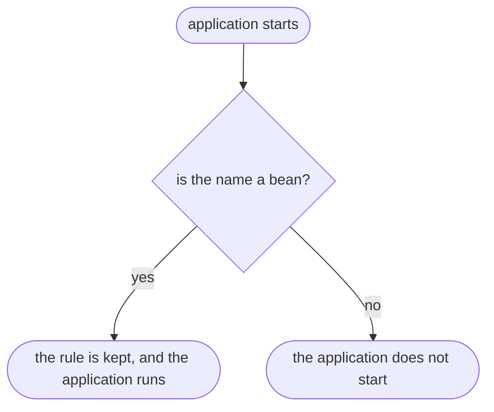

# Strategy with Spring Pattern — Data Flow Diagram

What happens to a configured rule name.

Mermaid source

```mermaid
flowchart TD
    Start(["application starts"])
    Look{"is the name a bean?"}
    Ok(["the rule is kept, and the application runs"])
    Stop(["the application does not start"])
    Start --> Look
    Look -- yes --> Ok
    Look -- no --> Stop
```

