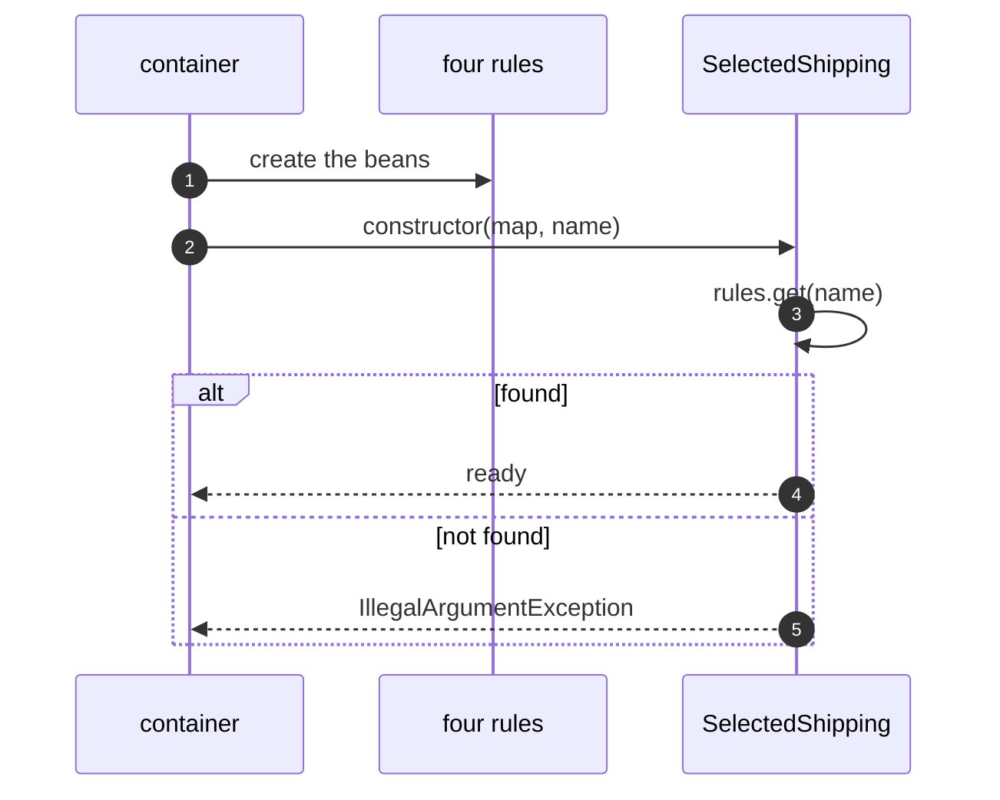

# Strategy with Spring Pattern — Sequence Diagram

Written for a listener with the screen off.

Say it in words. At startup the container creates the four rule beans and puts them in a map. It then builds the selected shipping component, passing the map and the configured name. The component looks the name up. If it finds a rule it keeps it. If it finds nothing, it throws, and the application does not start.

Mermaid source

The load-bearing sentence: **a wrong name is found at startup, not at checkout.**
