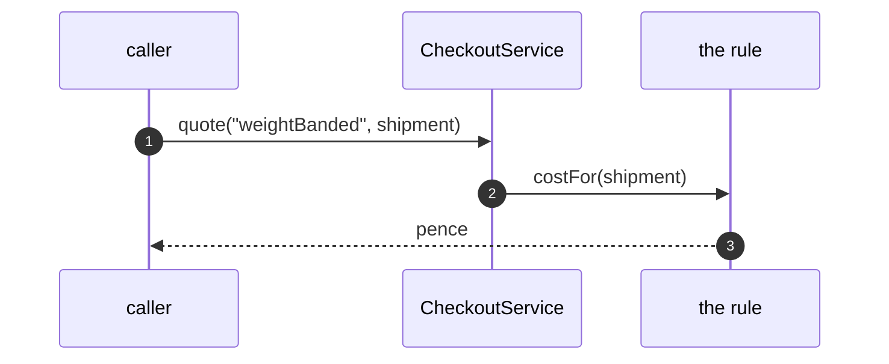
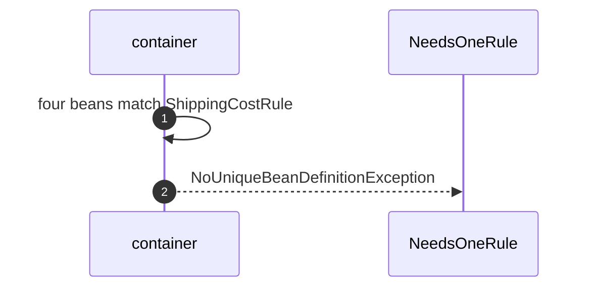

# Strategy with Spring Pattern — UML Sequence Diagrams

Four sequences.

## 1. Quote By Name

Mermaid source

```mermaid
sequenceDiagram
    autonumber
    participant K as caller
    participant C as CheckoutService
    participant R as the rule
    K->>C: quote("weightBanded", shipment)
    C->>R: costFor(shipment)
    R-->>K: pence
```

## 2. Ambiguous Injection

Mermaid source

```mermaid
sequenceDiagram
    autonumber
    participant C as container
    participant N as NeedsOneRule
    C->>C: four beans match ShippingCostRule
    C-->>N: NoUniqueBeanDefinitionException
```

