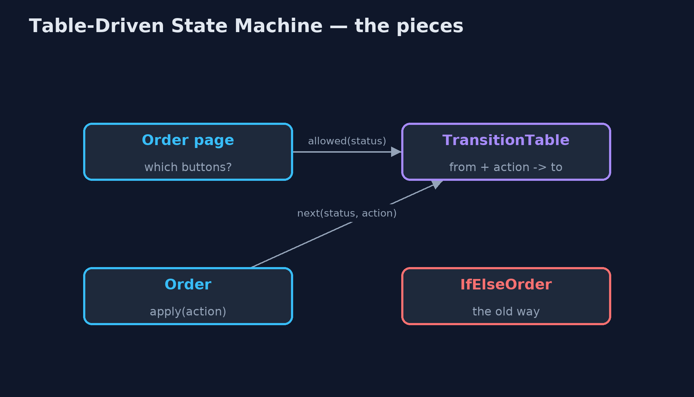
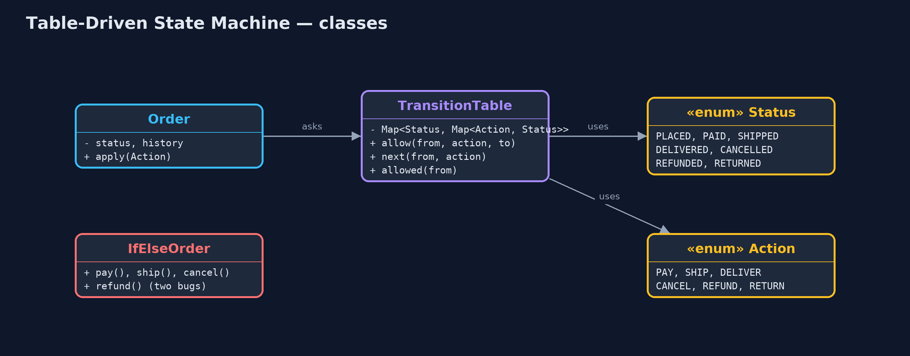

# Table-Driven State Machine Pattern

```
src/main/java/com/jk/explore/statetable/
├── Action.java           What can happen to an order: each one may move it to another status
├── IfElseOrder.java      Without the pattern: each method checks the status its own way
├── Order.java            An order whose status only changes by looking the move up in the table
├── StateTableDemo.java   The five acts: rules scattered in ifs, the table, wrong moves refused, a new rule, and the bill
├── Status.java           Where an order can be in its life
└── TransitionTable.java  The pattern: every allowed move, in one table
```

**Write down every allowed move as a row in one table, from this status on this action to that status, and refuse anything that is not in it.**

A state machine is anything that is always in exactly one of a few statuses,
and moves between them when something happens. An order is one: placed, paid,
shipped, delivered. A table-driven state machine keeps every allowed move in
one table: from this status, on this action, go to that status. The code that
changes the status just looks the move up. If it is not in the table, it is
refused.

The rules stop being scattered across `if` statements in many methods, where a
forgotten check is invisible. They sit in one place, where they can be read,
printed, tested and changed.

## The idea in everyday terms

Think of an airport. You go from check-in to security, from security to the
gate, from the gate onto the plane. Imagine if every desk kept its own idea of
what may come next, and one of them forgot to check you had been through
security. Instead, the airport has one chart of allowed steps, and every desk
checks it. A step that is not on the chart does not happen, however politely
you ask.

## The scenario

Orders in the online store move through placed, paid, shipped and delivered,
and can be cancelled or refunded. Each method (`pay`, `ship`, `cancel`,
`refund`) checked the status in its own way. Two checks were forgotten: a
delivered order could be cancelled, and an order could be refunded twice.

## Run

```bash
./gradlew run
```

The demo tells the story in 5 acts, each printing exact numbers that the tests check:

| Act | What it shows |
| --- | --- |
| 1. Rules in if statements | Each method checks the status its own way: a delivered order can be cancelled, and an order is refunded twice, £63.44 each time. |
| 2. The table | Five rows say every allowed move; ORD-1 goes PLACED, PAID, SHIPPED, DELIVERED by looking each one up. |
| 3. Wrong moves refused | Cancelling a DELIVERED order and refunding a REFUNDED one are refused by name; a PAID order's buttons are SHIP and REFUND. |
| 4. A new rule | Returns are added with 2 rows; a delivered order's buttons become RETURN, and ORD-1 is returned and refunded. |
| 5. The bill | 7 statuses x 6 actions is 42 cells, 7 of them allowed moves; paying refunds and sending emails are still code. |

## Test

```bash
./gradlew test
```

11 tests in `DemoRunsTest`, `TransitionTableTest`. Every number the demo prints is asserted, and nothing depends on the clock, so every run gives the same result.

## Technologies and versions

| Technology | Version | Used for |
| --- | --- | --- |
| Java | 21 | the code (toolchain set in `build.gradle`) |
| Gradle | 9.2.1 (wrapper) | build and run, nothing to install |
| JUnit | 5.10.2 | the tests |
| videokit | repository tool | the narrated video and animation: Piper `en_US-amy-medium`, speed 0.8, longer pauses (the approved `amy-slow` voice) |

## Learning Material

| Document | What it is for |
| --- | --- |
| [Problem statement](docs/problem-statement.md) | the situation and what the project must show |
| [Prerequisites](docs/prerequisites.md) | what you need to know first |
| [Table-Driven State Machine, explained](docs/table-driven-state-machine-pattern-explained.md) | the acts in prose |
| [Session guide](docs/session.md) | a one-hour lesson with exercises |
| [Animated walkthrough](docs/animation.html) | the acts step by step, narrated |
| [Spec](docs/spec.md) | what this project must be true of |

### The pattern in one picture

The order and the page both ask the table; the rules live nowhere else.



### Where each piece sits

Two enums and one map hold the rules.



### How the data moves

Each arrow is one row of the table, labelled with its action.


### Who calls whom, in order

The order asks the table; the table answers with the next status or nothing.


### Video

`video/table-driven-state-machine-pattern-explained.mp4` (with `.m4a` audio and `.srt` subtitles) is built by `video/build_video.sh`. Rendered media is not committed.

## What it costs

- **Where, not what.** The table says which moves are allowed. Paying the refund and sending the email are still code, attached to the moves.
- **Big tables are hard to read.** Seven statuses and six actions make 42 cells; draw it as a diagram once it grows.
- **Conditions need more.** A rule such as "refund only within 30 days" is not a plain cell; it needs a check attached to the move.

## When this is too much

An object with two statuses, such as on and off, needs a boolean, not a table.
And when each status has a lot of its own behaviour, not just different next
statuses, the classic State pattern, one class per status, may fit better.

## Where you have already met this

- Spring State Machine and similar libraries configure transitions as a table.
- Workflow and ticket systems such as Jira, where an admin edits the allowed transitions.
- Order, payment and shipment statuses in almost every shop.
- Parsers and network protocols, which are built on state tables.

## Where this sits

This project is in [behavioural](..), next to the [State](../state-pattern)
pattern, which gives each status its own class. The table is the simpler
choice when statuses differ mainly in where they can go next.
