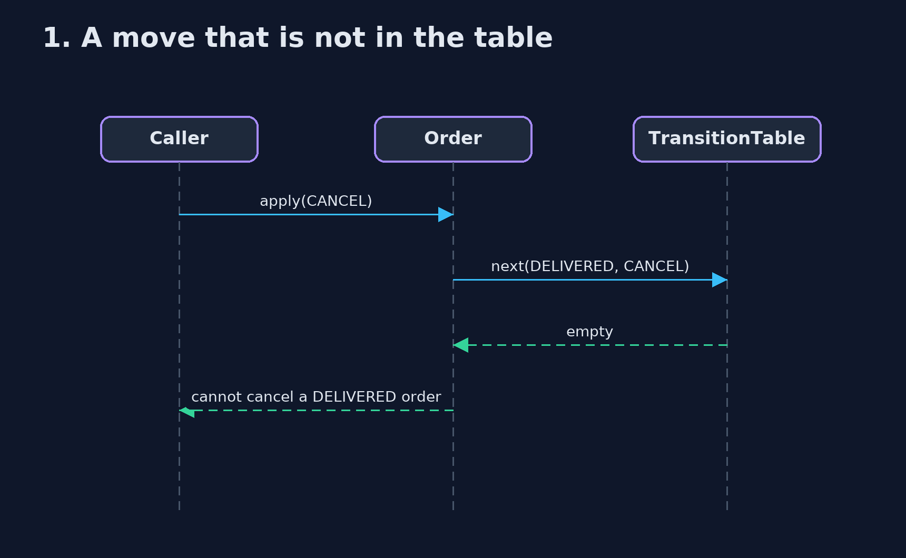
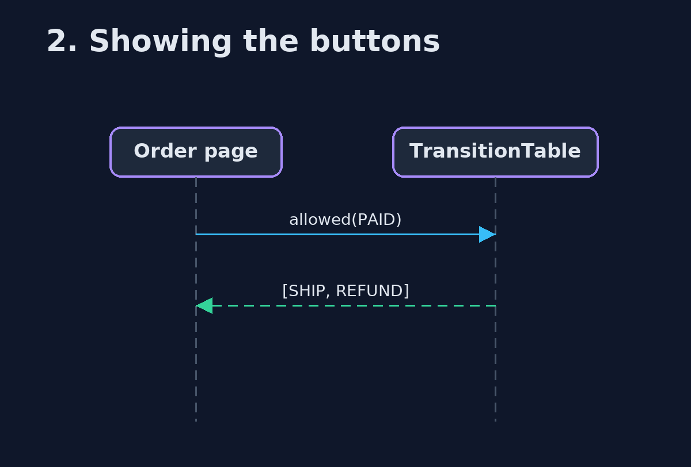

# Table-Driven State Machine Pattern — UML Sequence Diagrams

## 1. 1. A move that is not in the table

Nothing to look up, so the move is refused.

## 2. 2. Showing the buttons

The page asks what is allowed, instead of repeating the rules.

