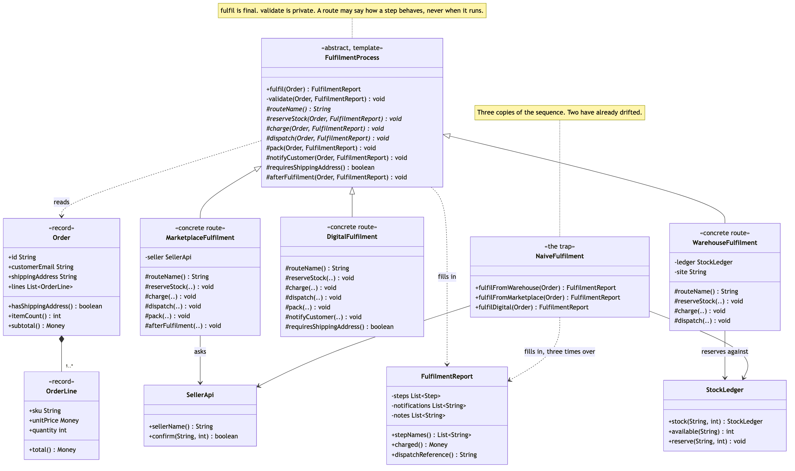

# Template Method Pattern

Demonstrates the Behavioural **Template Method** design pattern using order
fulfilment in an online shop as an example.

- `FulfilmentProcess` — the abstract class, and the whole pattern. Its
  `fulfil(Order)` is `final`: seven calls in a fixed order, and the only thing
  in the system that knows those steps have an order at all. Everything else
  in the class is a decision about what kind of hole each step should be.
- `validate` — the `private` step. It cannot be overridden, so no route can
  weaken the checks for the routes that come after it.
- `reserveStock` / `charge` / `dispatch` / `routeName` — the abstract steps.
  Every route must answer them, because no default could be right for holding
  warehouse stock, asking a marketplace seller to confirm, and minting a
  licence key all at once.
- `pack` / `notifyCustomer` — the steps with defaults. A route that wants the
  usual behaviour writes nothing; only the routes that genuinely differ speak.
- `requiresShippingAddress()` / `afterFulfilment()` — the two hooks. One is a
  question the base class asks, the other an empty method called on every run
  so a route has somewhere to stand.
- `WarehouseFulfilment` / `MarketplaceFulfilment` / `DigitalFulfilment` — the
  three routes, overriding four, six and seven methods respectively. The
  shortest one is the most ordinary one, which is the sign the defaults were
  chosen well.
- `NaiveFulfilment` — the trap, kept for contrast. Three methods, each
  spelling the six steps out by hand. Its warehouse copy is still correct on
  purpose: the argument is drift, not incompetence.
- `FulfilmentReport` — the evidence. Every step writes itself onto the report,
  so the project can *show* that four routes produce an identical list of step
  names rather than asserting it. Notes are kept apart from steps, so posting
  one cannot change the sequence a test asserts on.
- `Order` / `OrderLine` / `Money` / `StockLedger` / `SellerApi` /
  `LicenceKeys` / `FulfilmentException` — the supporting types. Pennies as
  `long`, so the amounts in the output are the amounts a customer is charged.
- `FulfilmentDemo` — runnable entry point that shows the hand-written routes
  emailing a licence key that does not exist yet, the same three routes run
  through the template, the hook answering for one route only, a fourth route
  defined inside the demo file itself, and an honest note about what the
  pattern cost.

## Run

```bash
./gradlew run
```

Which prints:

```text
=== 1. The trap: three hand-written copies of the same sequence ===

  A download, fulfilled by NaiveFulfilment.fulfilDigital:
    validate       2 line(s), no address needed
    reserve        nothing to reserve, 2 download(s)
    charge         £14.49 taken by the store
    pack           nothing to pack
    notify         emailed sam@example.com with the key
    dispatch       licence key issued: KEY-D-9001-E-777
    email sent:
      sam@example.com: Order D-9001 is ready to download. Key: (not dispatched)
  The customer was told before the key existed.

  A marketplace order the seller will not confirm:
    Acme Optics will not confirm T-410
    but the card was charged £42.00 one step earlier.

  Both are one line in the wrong place, in a copy nobody rereads.

=== 2. The pattern: one sequence, three routes ===

  warehouse (A-1001)
    validate       2 line(s), 3 item(s), £187.48, address checked
    reserve        3 unit(s) held at Reading
    charge         £187.48 taken by the store
    pack           3 item(s) boxed and labelled
    dispatch       courier collected, consignment CON-A-1001
    notify         emailed grace@example.com
    email: grace@example.com: Order A-1001 is on its way. Tracking: CON-A-1001

  marketplace (M-1002)
    validate       1 line(s), 1 item(s), £129.00, address checked
    reserve        Acme Optics confirmed 1 line(s)
    charge         £129.00 taken, £15.48 commission retained
    pack           nothing boxed here — Acme Optics packs their own
    dispatch       job MP-M-1002 queued for Acme Optics
    notify         emailed priya@example.com
    email: priya@example.com: Order M-1002 is on its way. Tracking: MP-M-1002
    note : seller ledger: £15.48 commission posted against Acme Optics

  digital (D-1003)
    validate       2 line(s), 2 item(s), £14.49, no address needed
    reserve        nothing to reserve, 2 download(s)
    charge         £14.49 taken by the store
    pack           nothing to pack
    dispatch       licence key issued: KEY-D-1003-E-777
    notify         emailed sam@example.com with the key
    email: sam@example.com: Order D-1003 is ready to download. Key: KEY-D-1003-E-777

  step names, warehouse   : [validate, reserve, charge, pack, dispatch, notify]
  step names, marketplace : [validate, reserve, charge, pack, dispatch, notify]
  step names, digital     : [validate, reserve, charge, pack, dispatch, notify]
  Identical, and no route chose that. FulfilmentProcess.fulfil did.

  This time the digital email carries the key, because dispatch
  runs before notify and no subclass is allowed a say in that.

=== 3. The hook: one question, two answers ===

  digital, no address     : validate       1 line(s), 1 item(s), £9.99, no address needed
  warehouse, no address   : refused — order A-1005 has no shipping address

  requiresShippingAddress() is the only say a route gets in
  validation. It cannot skip the check, only answer it.

=== 4. A fourth route, added without touching the base class ===

  click-and-collect (C-1006)
    validate       1 line(s), 1 item(s), £24.00, no address needed
    reserve        1 unit(s) held at the Bristol counter
    charge         £24.00 taken by the store
    pack           1 item(s) boxed and labelled
    dispatch       moved to the collection shelf, PICKUP-C-1006
    notify         emailed leo@example.com
    email: leo@example.com: Order C-1006 is ready to collect from Bristol. Quote PICKUP-C-1006

  Four required steps, one hook, one override. Six steps, in the
  same order as the other three, for free.

=== 5. What it cost ===

  Inheritance. Every route is welded to FulfilmentProcess and can
  extend nothing else, and a new step in the base class lands on
  all four at once. Compose strategies instead when the steps are
  independent enough to be swapped at runtime; use this when the
  ORDER is the thing you are trying to guarantee.
```

Section 1 and section 2 fulfil the same kinds of order. The difference between
them is the whole project: in section 1 the six steps are typed out three
times, and in section 2 they are typed once.

## Test

```bash
./gradlew test
```

46 tests across 3 classes. `FulfilmentProcessTest` tests the base class
through a `RecordingRoute` whose steps do nothing but write down that they
were called, in four `@Nested` groups — the sequence itself, validation, the
two hooks, and the defaults — including the assertion that the steps run in
exactly the order the template defines, and that a note posted by a hook is
never a step. `FulfilmentRouteTest` covers the three real routes in four
`@Nested` groups, one per route plus a group that runs all three and checks
their step names come out identical. `NaiveFulfilmentTest` holds the
comparison: the two drifted copies pinned as *passing* tests that assert the
wrong behaviour, including an email whose body ends `Key: (not dispatched)`.

## Learning Material

Start here if you are new to the pattern — the docs are ordered as a
learning path.

| Document | What it covers |
| --- | --- |
| [`docs/prerequisites.md`](docs/prerequisites.md) | What to know and install before you start |
| [`docs/problem-statement.md`](docs/problem-statement.md) | The problem the pattern solves, and why the naive approach hurts |
| [`docs/template-method-pattern-explained.md`](docs/template-method-pattern-explained.md) | The pattern itself, the code walked through, pitfalls, and comparisons |
| [`docs/class-diagram.md`](docs/class-diagram.md) | Static structure |
| [`docs/uml-diagram.md`](docs/uml-diagram.md) | Runtime call flow |
| [`docs/animation.html`](docs/animation.html) | Animated, step-by-step walkthrough — open in a browser. Optional narration via the **Narration** button |
| [`docs/session.md`](docs/session.md) | A 60-minute guided session plan for teaching it |
| [`docs/youtube.md`](docs/youtube.md) | Title, description, chapters and thumbnail for publishing the video |
| [`docs/thumbnail.png`](docs/thumbnail.png) | The 1280×720 image to upload as the YouTube thumbnail |
| [`docs/spec.md`](docs/spec.md) | The project specification — problem, code, video and publishing quality bar. Also as [`spec.html`](docs/spec.html) |
| [`video/`](video/) | A narrated video, plus the script and build pipeline |

### The pattern in one picture



### Video

`video/template-method-pattern-explained.mp4` — 1080p, narrated. An
audio-only version is alongside it. See [`video/README.md`](video/README.md)
to rebuild or re-record it.

## Also available with a framework

[Template Method with Spring Pattern](../template-method-with-spring-pattern) reruns this idea on a real framework, and shows what the framework adds and where it can undo the pattern. Watch this project first.
