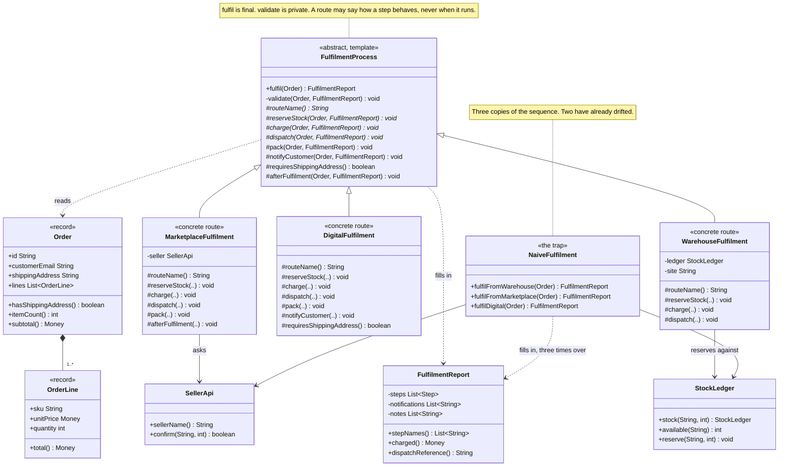

# Template Method Pattern — Class Diagram

Shows the static structure. `FulfilmentProcess` owns the sequence and marks
`fulfil` `final`; the three routes fill in the holes. What is worth reading
carefully is not the inheritance arrows — those are obvious — but *which
methods each route overrode*, because that is the entire design decision the
base class makes on the subclasses' behalf.

Mermaid source

## Notes

**`fulfil` is the only public method on the base class, and it is `final`.**
Everything else is `protected` or `private`. That is the pattern stated in
access modifiers: the outside world gets one entry point, subclasses get a
set of holes, and nobody gets to change the order.

**Three kinds of hole, and the diagram distinguishes them.** The abstract
steps are marked with `*` — `routeName`, `reserveStock`, `charge`,
`dispatch`. `pack` and `notifyCustomer` are concrete steps with a working
default. `requiresShippingAddress` and `afterFulfilment` are hooks: one
answers a question validation asks, the other is empty. Deciding which of
the three a given step should be is most of the work of using this pattern.

**Count the overrides in each route.** `WarehouseFulfilment` overrides only
the four required steps, because the defaults were written with it in mind.
`MarketplaceFulfilment` adds two. `DigitalFulfilment` adds three, and it is
the reason the hooks exist at all — an order with no address, nothing to
reserve and nothing to pack would be impossible to express otherwise without
weakening the base class for everybody.

**`validate` is private, not protected, and that is deliberate.** It is the
one part of the sequence a subclass genuinely must not be able to replace.
The only influence a route has over it is answering
`requiresShippingAddress()` — a much narrower permission than "override
validate", and the difference between a base class that guarantees something
and one that merely asks nicely.

**No arrow runs from `FulfilmentProcess` to `StockLedger` or `SellerApi`.**
The base class knows about orders and reports and nothing else. Warehouses
and marketplaces are entirely the subclasses' business, which is why a
fourth route can be added — as `FulfilmentDemo` does with click-and-collect
— without the base class learning a new word.

**`NaiveFulfilment` has three arrows where the pattern has one.** It reaches
the same report, three separate times, through three method bodies that each
have to remember the sequence for themselves.

See [`uml-diagram.md`](uml-diagram.md) for one call to `fulfil` in sequence,
which is where the fixed order and the subclass callbacks become visible.
