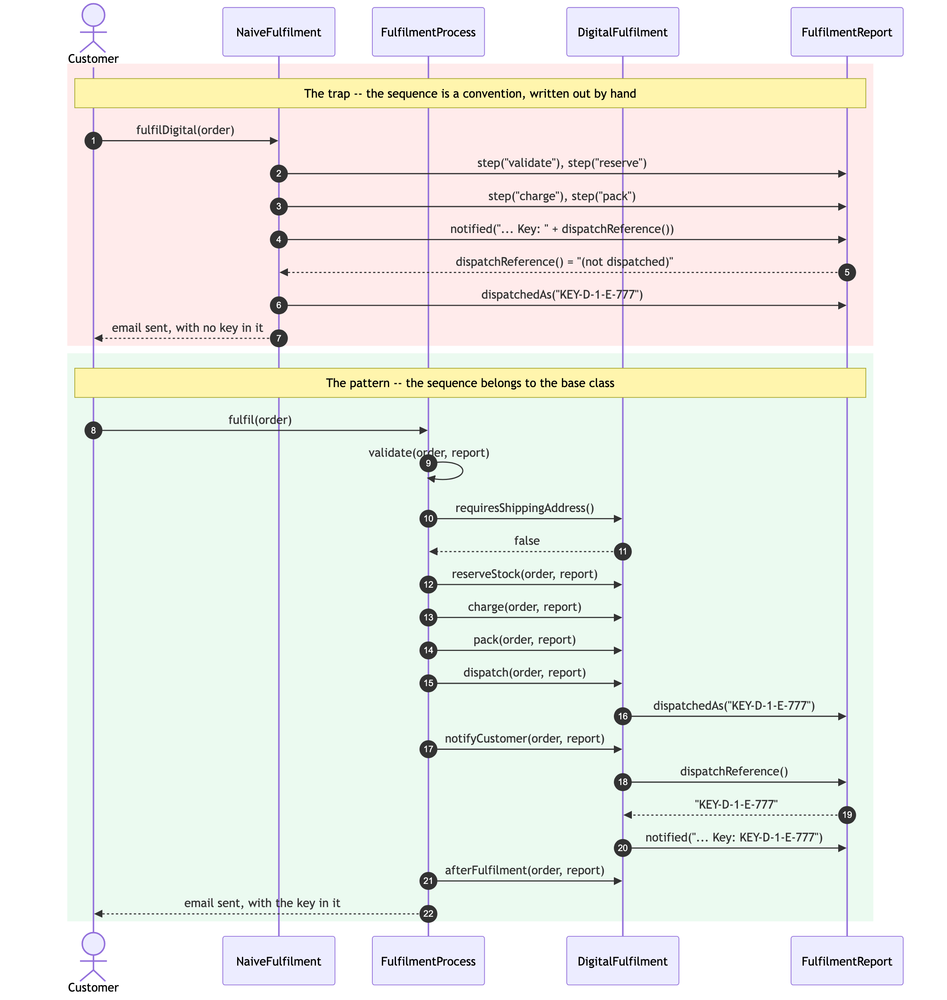
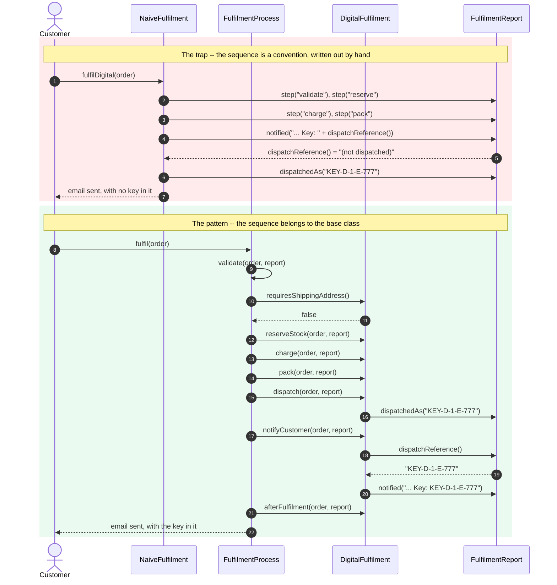

# Template Method Pattern — Sequence Diagram

Two runs of the same order: a download that has to be paid for, issued a
licence key, and emailed to the customer.

The first half is the hand-written route. The second half is the pattern.
The divergence is entirely in **who decides the order of the last two
steps**.

Mermaid source

## Reading It

**Steps 1 to 7 — the naive run.** Nothing here is unreasonable in isolation.
Somebody wrote six steps out, and at some point somebody moved two of them.
The report is asked for a dispatch reference that has not been set yet, so
the customer's email quotes the placeholder `(not dispatched)`. No exception,
no failing compile — the order is fulfilled, the money is taken, and the
email is useless.

**Step 9 is the shape of the pattern.** The customer calls `fulfil` on the
base class, not on the route. From here on every arrow points *downward* into
the subclass: the base class is driving, and `DigitalFulfilment` is being
called back. That inversion is what people mean by "the Hollywood
principle" — don't call us, we'll call you.

**Steps 11 and 12 are the hook.** Validation asks the route one question and
the route answers `false`. Notice what it did *not* get to do: it did not
skip validation, it did not replace it, and it could not have. The order
still has to have lines and an email address.

**Steps 13 to 16 are the required steps**, handed out in the order the base
class fixed. Each one records a step on the report, so the sequence ends up
observable rather than merely intended.

**Steps 17 to 20 are the payoff.** `notifyCustomer` reads a value that
`dispatch` set, and it can rely on that value existing because `fulfil` is
`final`. The naive version had exactly the same two lines of code and got the
wrong answer, because nothing was guaranteeing the order.

**Step 21 — the empty hook, called anyway.** `afterFulfilment` does nothing
for this route. The base class calls it regardless, because a route that
*does* need it — `MarketplaceFulfilment`, posting its commission — must not
have to ask for the call site.

## What Is Not Drawn

**The other three routes.** Warehouse, marketplace and click-and-collect run
the identical set of arrows from step 9 onward, with different bodies behind
them. Drawing a second one would add nothing, which is exactly the claim
being made: `FulfilmentDemo` prints all four step lists and they are
character-for-character identical.

**Failure.** If `charge` throws, the arrows for `pack`, `dispatch`,
`notifyCustomer` and `afterFulfilment` never happen. There is nothing to
draw, and that absence is the design — a later step must never run on the
assumption that an earlier one succeeded.

**The subclass calling back into the base class.** It does not happen. No
route calls `fulfil`, and only the two default steps ever call `super`. The
traffic is one-way by construction.

See [`class-diagram.md`](class-diagram.md) for the static structure, and
[`animation.html`](animation.html) to step through one `fulfil` call a
message at a time.
