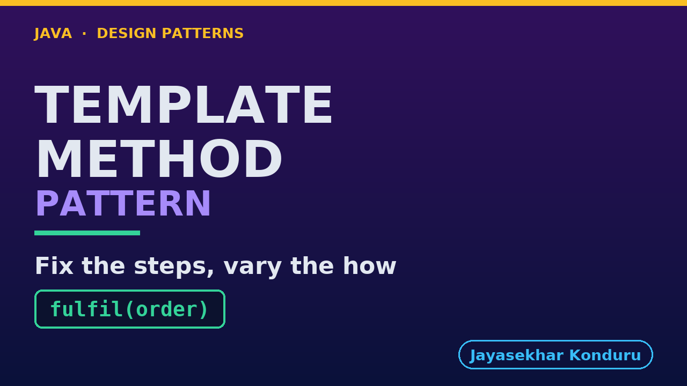

# YouTube — Template Method Pattern

Everything needed to publish `video/template-method-pattern-explained.mp4`. Copy the fields straight out of this file.

Chapter timings are generated from the video's `.srt`. Re-run `python3 docs/make_youtube_docs.py template-method` after any change to the narration, or they will be wrong.

## Title

```
Template Method Pattern in Java - Fulfilment Steps
```

50 characters — under the 60 YouTube shows before truncating in search results.

## Description

The first two lines are what a viewer sees above the fold, so they carry the hook rather than the boilerplate.

```
Learn the Template Method design pattern in Java 21 by building order fulfilment for an online store three completely different ways — own warehouse, marketplace seller and digital download. We start with the problem — three hand-written copies of the same six-step sequence, one of which drifted, so a customer is emailed a licence key before the key is minted and another is charged before the seller refuses the order — and end with a single `final` template method that owns the order, abstract steps a route must answer, defaults it can inherit, hooks it can opt into, a fourth route added without reopening a single working file, and a test that asserts on the call order directly. Also covers the three kinds of hole and how to choose between them, the inheritance slot the pattern spends permanently, and how Template Method differs from Factory Method and from Strategy. No prior design-pattern knowledge needed. Full source code and written notes are in the repository.

CHAPTERS
00:00 Introduction
00:57 The Scenario
01:43 The Obvious First Move
02:18 The Naive Approach — Two Lines the Wrong Way Round
03:15 Why That Hurts
04:11 The Template Method Pattern
04:49 Everyday Analogy: The Recipe
05:36 The Roles
06:32 The Template Method — Seven Lines and One Keyword
07:30 Three Kinds of Hole
08:46 Why the Order Being Fixed Is Worth Something
09:35 The Test That Proves It
10:21 Running It
11:09 What to Remember
12:38 Thanks for Watching

SOURCE CODE, WRITTEN NOTES AND AN INTERACTIVE ANIMATION
https://github.com/jk-boot-up/java-design-patterns/tree/main/gradle-java/behavioural/template-method-pattern

WHAT YOU NEED FIRST
Java 21 and a working knowledge of classes and interfaces. No prior design-pattern knowledge is assumed. The full prerequisites are in docs/prerequisites.md in the repository.
```

## Chapters

YouTube renders these as chapters only if there are at least three and the first is at `00:00`.

```
00:00 Introduction
00:57 The Scenario
01:43 The Obvious First Move
02:18 The Naive Approach — Two Lines the Wrong Way Round
03:15 Why That Hurts
04:11 The Template Method Pattern
04:49 Everyday Analogy: The Recipe
05:36 The Roles
06:32 The Template Method — Seven Lines and One Keyword
07:30 Three Kinds of Hole
08:46 Why the Order Being Fixed Is Worth Something
09:35 The Test That Proves It
10:21 Running It
11:09 What to Remember
12:38 Thanks for Watching
```

## Tags

```
template method pattern, workflow java, inheritance hooks, design patterns, java design patterns, gang of four, java 21, software design, clean code, object oriented design, java tutorial, ecommerce, programming tutorial
```

220 characters, under YouTube's 500 limit.

## Thumbnail



**Upload `docs/thumbnail.png`** — 1280×720, the size YouTube recommends, generated by `docs/make_thumbnails.py`. It is deliberately not the same image as the video's opening frame: a thumbnail is judged at about 360 pixels wide in a search result, so this one carries only the pattern name, one line of promise and one short piece of code, each set large enough to survive the shrink.

`video/poster.png` is the 1920×1080 opening frame, produced by the video build. It stays in the repository as the title card; it is not what gets uploaded.

YouTube will not pick the thumbnail up on its own — upload it under **Details → Thumbnail → Upload file**. A custom thumbnail requires a verified channel.

## Upload checklist

- [ ] Upload `video/template-method-pattern-explained.mp4` (1080p, H.264, 30 fps, AAC 48 kHz — already YouTube's recommended settings, no re-encode needed)
- [ ] Set the video language to **English** first, or the subtitle option may not appear
- [ ] Add subtitles: *Video elements → Add subtitles → Upload file → With timing* → `video/template-method-pattern-explained.srt`
- [ ] Upload `docs/thumbnail.png` as the thumbnail — do not let YouTube auto-pick a frame
- [ ] Paste the title, description and tags from above
- [ ] Add to the **Java Design Patterns** playlist, in learning order
- [ ] Wait for 1080p processing before sharing the link — code slides are unreadable at 360p

## Cards and end screen

End screen links to whichever pattern video goes up next — set it at upload time rather than assuming an order.

Add a card partway through pointing at the playlist, so a viewer who arrives at this pattern from search can find the rest of the series.

## Runtime

Approximately 13:17, narrated at 145 words per minute.
