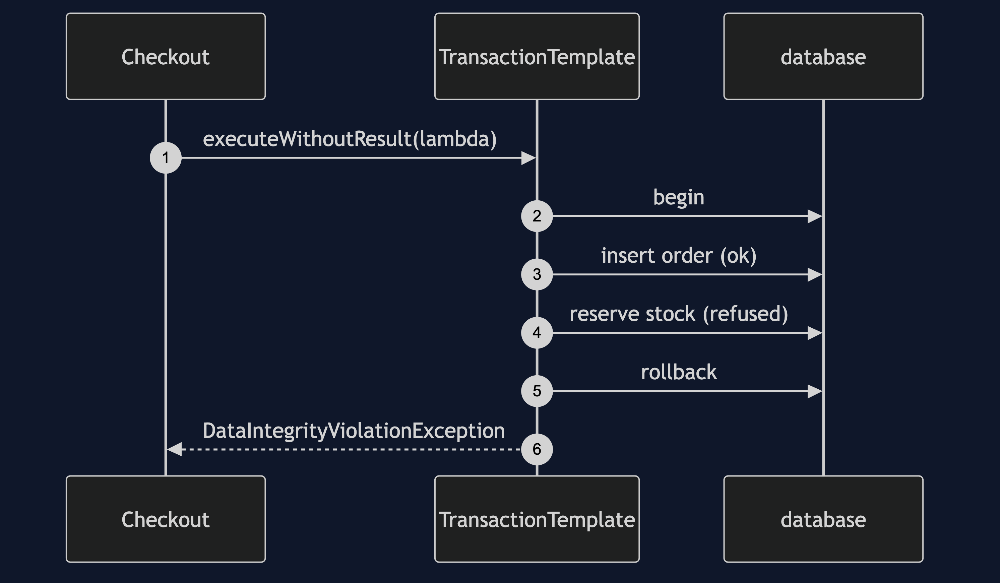

# Template Method with Spring Pattern

```
src/main/java/com/jk/explore/templatespring/
├── FulfilmentApplication.java   the Spring Boot entry point and the six acts
├── OrderRepository.java         the same query, by hand and through JdbcTemplate
├── Checkout.java                a TransactionTemplate around two writes
└── Order.java                   a record
src/main/resources/
└── schema.sql                   two tables and four rows
```

**A template owns the fixed steps, and a lambda supplies the one step that differs. Spring uses a callback where the partner used a subclass.**

This project is the framework version of [Template Method](../template-method-pattern). That project built the mechanism by hand. This one shows the same idea inside Spring Boot. It does not re-teach the pattern. It shows what Spring Boot adds, the failures that are its own, and what it costs.

## Run

```bash
./gradlew run
```

Six acts. The partner project, Template Method, built the mechanism by hand. Here the same idea runs through Spring Boot, and every count comes from real output.

```
ONE. Plain JDBC leaks on the error path.
  a good query returns [ORD-000001, ORD-000002, ORD-000003]. connections in use afterwards: 0.
  a query with a typo throws JdbcSQLSyntaxErrorException. connections in use afterwards: 1.
  the pool has two connections, so a second typo leaves one, and a third waits for a connection that never comes back.
TWO. The template closes on every path.
  a good query returns [ORD-000001, ORD-000002, ORD-000003]. connections in use afterwards: 0.
  the same typo, three times: connections in use afterwards: 0.
THREE. What is ours, and what is not.
  asha's orders: [Order[orderNumber=ORD-000001, customer=asha, totalPence=2499], Order[orderNumber=ORD-000003, customer=asha, totalPence=1250]]
  we wrote one lambda, which turns a row into an Order. The template opened the
  connection, prepared the statement, bound the customer, ran it, walked the rows,
  and closed everything.
FOUR. Exceptions, translated.
  by hand: JdbcSQLSyntaxErrorException, a checked exception, SQL state 42S02.
  template: BadSqlGrammarException, unchecked, the same on every database.
  a repeated order number: DuplicateKeyException.
FIVE. What the template does not decide for you.
  one row expected, none found: EmptyResultDataAccessException.
  one row expected, two found: IncorrectResultSizeDataAccessException.
  the fixed steps are the template's. What counts as a missing row is a decision it made for you.
SIX. A transaction is a template too.
  before: 3 orders, 3 mugs on hand.
  after a good checkout: 4 orders, 1 mug on hand.
  a checkout for 4 mugs fails: DataIntegrityViolationException.
  after it: 4 orders, 1 mug on hand. the order row was rolled back.
```

## Test

```bash
./gradlew test
```

2 test classes, 8 test methods, offline, with each Spring context started inside the test, and no server.

## Technologies and versions

| What | Version | Why it is here |
| --- | --- | --- |
| Java | 21 | The repository standard, via the Gradle toolchain block |
| Gradle | 9.2.1 | The wrapper in this directory; no separate install needed |
| Spring Boot | 4.1.1 | The container and JDBC support |
| H2 | managed | An in-memory database |
| HikariCP | managed | The connection pool, two connections here |
| JUnit 5 | 5.10.2 | Test runner |

See [`docs/dependencies.md`](docs/dependencies.md).

## Learning Material

| Document | What it covers |
| --- | --- |
| [`docs/problem-statement.md`](docs/problem-statement.md) | The partner's fulfilment, and what is new |
| [`docs/template-method-with-spring-pattern-explained.md`](docs/template-method-with-spring-pattern-explained.md) | A template made of callbacks |
| [`docs/class-diagram.md`](docs/class-diagram.md) | The types |
| [`docs/architecture-diagram.md`](docs/architecture-diagram.md) | Your lambda, the template, the pool |
| [`docs/data-flow-diagram.md`](docs/data-flow-diagram.md) | What the template does around your lambda |
| [`docs/sequence-diagram.md`](docs/sequence-diagram.md) | Written for a listener with the screen off |
| [`docs/uml-diagram.md`](docs/uml-diagram.md) | Four sequences |
| [`docs/animation.html`](docs/animation.html) | The six acts in a browser |
| [`docs/prerequisites.md`](docs/prerequisites.md) | What you need to know |
| [`docs/session.md`](docs/session.md) | A one-hour taught session |
| [`docs/spec.md`](docs/spec.md) | The generated specification |
| [`docs/youtube.md`](docs/youtube.md) | Title, description and chapters |
| [`docs/dependencies.md`](docs/dependencies.md) | What Spring Boot is, what it costs, and that skipping this project loses none of the pattern |

### The pattern in one picture


### Where each piece sits


### How one request moves


### Who calls whom, in order



### All four sequences


### Video

Built from [`video/scenes.py`](video/scenes.py) by
[`video/build_video.sh`](video/build_video.sh). The rendered file is not
committed; see the repository README for why.

## Where you have already met this

Every Spring `*Template` class. Each owns the fixed steps of talking to something and asks for the step that differs.

## When this is too much

For one query in a script, plain JDBC with try-with-resources is fine. The template earns its place when many callers repeat the fixed steps.

## Where this sits

This project pairs with [Template Method](../template-method-pattern), and is a framework version in [`behavioural`](..).
