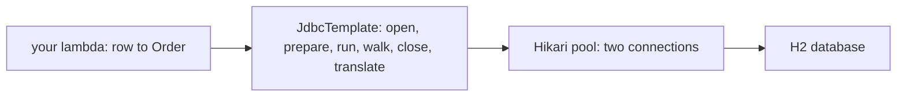

# Template Method with Spring Pattern — Architecture Diagram

Your lambda sits inside the template, which sits on the pool.

Mermaid source

```mermaid
flowchart LR
    Y["your lambda: row to Order"] --> T["JdbcTemplate: open, prepare, run, walk, close, translate"]
    T --> P["Hikari pool: two connections"]
    P --> H["H2 database"]
```

