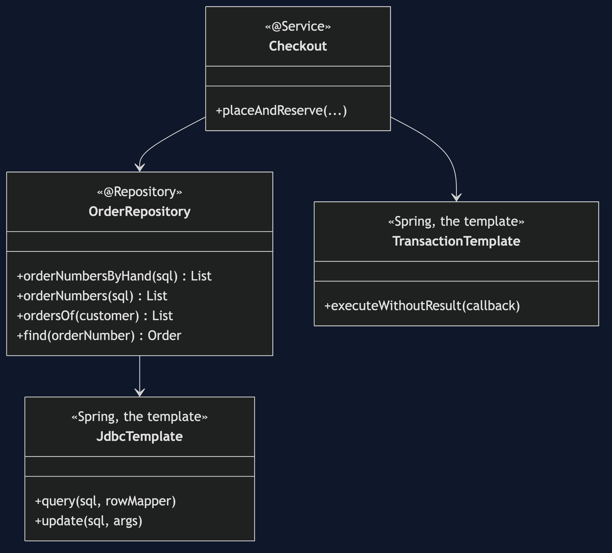
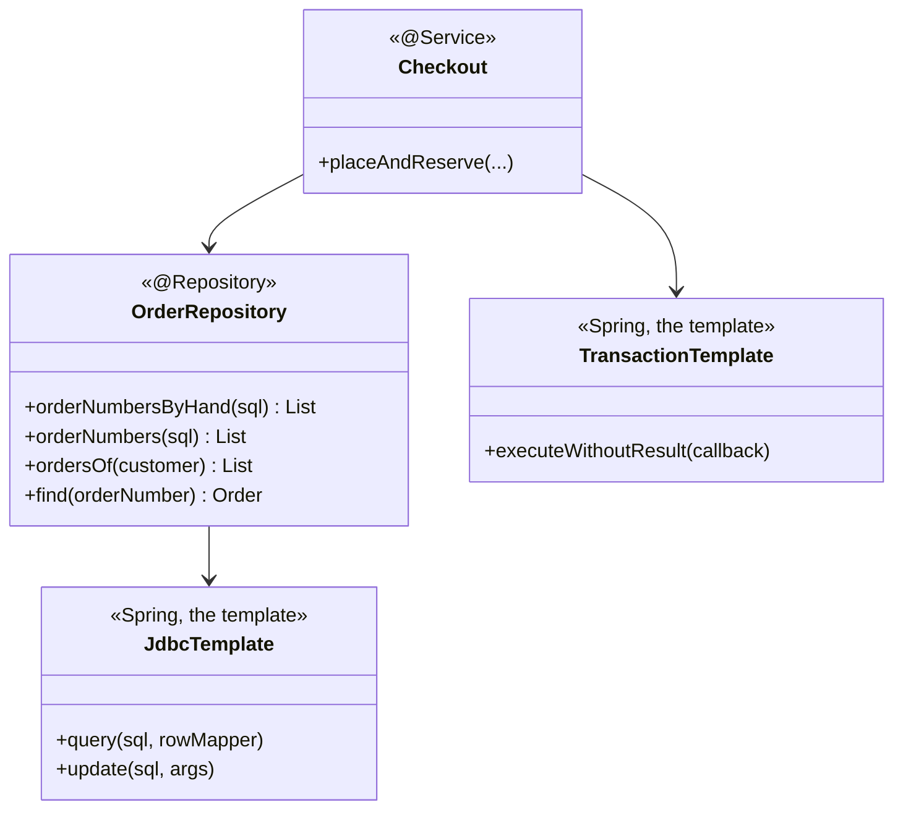

# Template Method with Spring Pattern — Class Diagram

The repository writes the same query twice. The checkout gives a transaction template two writes.

Mermaid source

```mermaid
classDiagram
    class OrderRepository {
        <<@Repository>>
        +orderNumbersByHand(sql) List
        +orderNumbers(sql) List
        +ordersOf(customer) List
        +find(orderNumber) Order
    }
    class JdbcTemplate {
        <<Spring, the template>>
        +query(sql, rowMapper)
        +update(sql, args)
    }
    class TransactionTemplate {
        <<Spring, the template>>
        +executeWithoutResult(callback)
    }
    class Checkout {
        <<@Service>>
        +placeAndReserve(...)
    }
    OrderRepository --> JdbcTemplate
    Checkout --> TransactionTemplate
    Checkout --> OrderRepository
```

