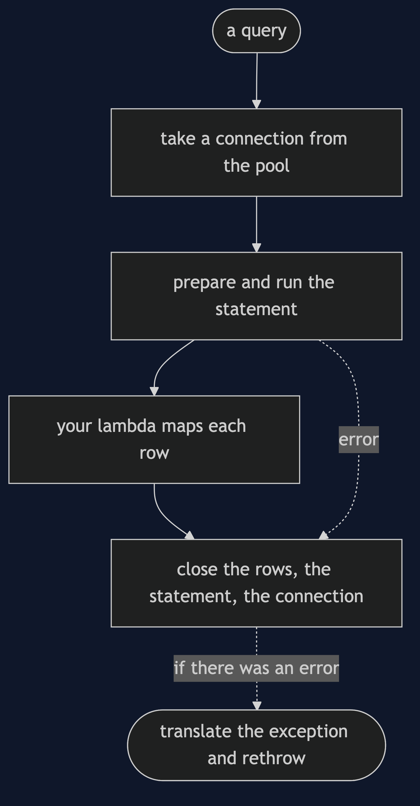
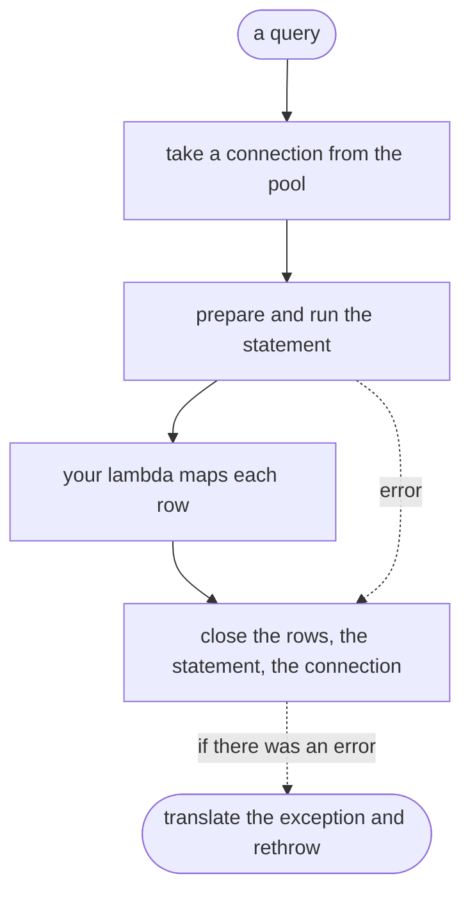

# Template Method with Spring Pattern — Data Flow Diagram

What the template does around your lambda.

Mermaid source

```mermaid
flowchart TD
    Start(["a query"])
    Open["take a connection from the pool"]
    Run["prepare and run the statement"]
    Map["your lambda maps each row"]
    Close["close the rows, the statement, the connection"]
    Fail(["translate the exception and rethrow"])
    Start --> Open --> Run --> Map --> Close
    Run -. error .-> Close
    Close -. if there was an error .-> Fail
```

