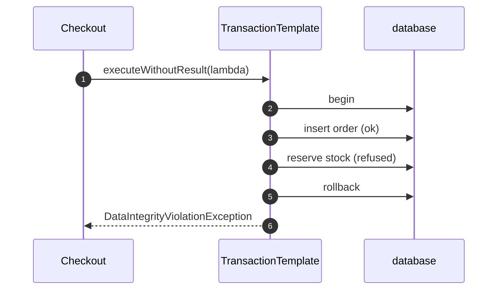

# Template Method with Spring Pattern — Sequence Diagram

Written for a listener with the screen off.

Say it in words. Checkout hands the transaction template a lambda. The template begins a transaction. The lambda inserts the order, which succeeds. The lambda then reserves the stock, and the database refuses, because the stock would go below zero. The exception leaves the lambda. The template rolls back the transaction, so the inserted order disappears, and it rethrows the translated exception to the caller.

Mermaid source

The load-bearing sentence: **the fixed steps of a transaction belong to the template.**
