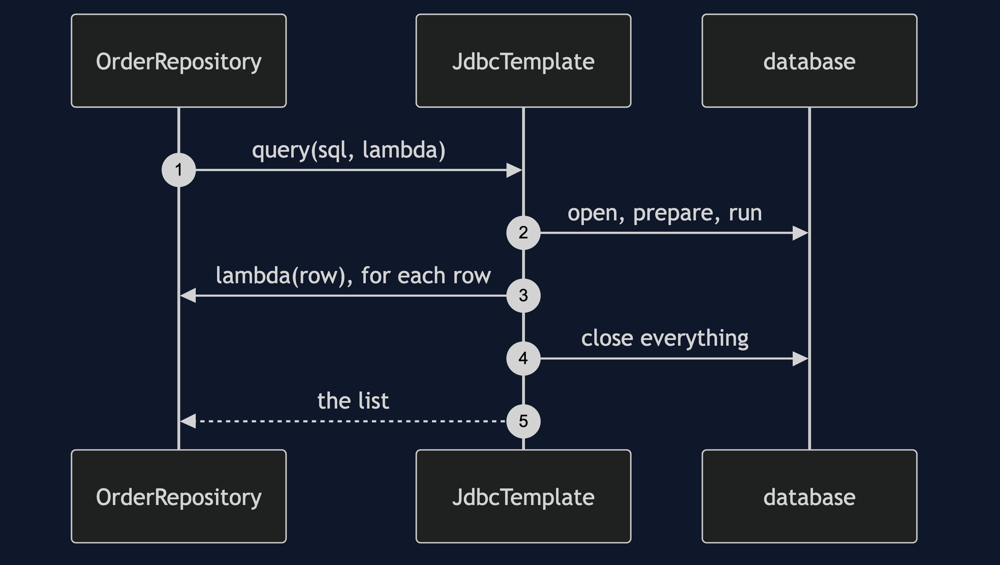
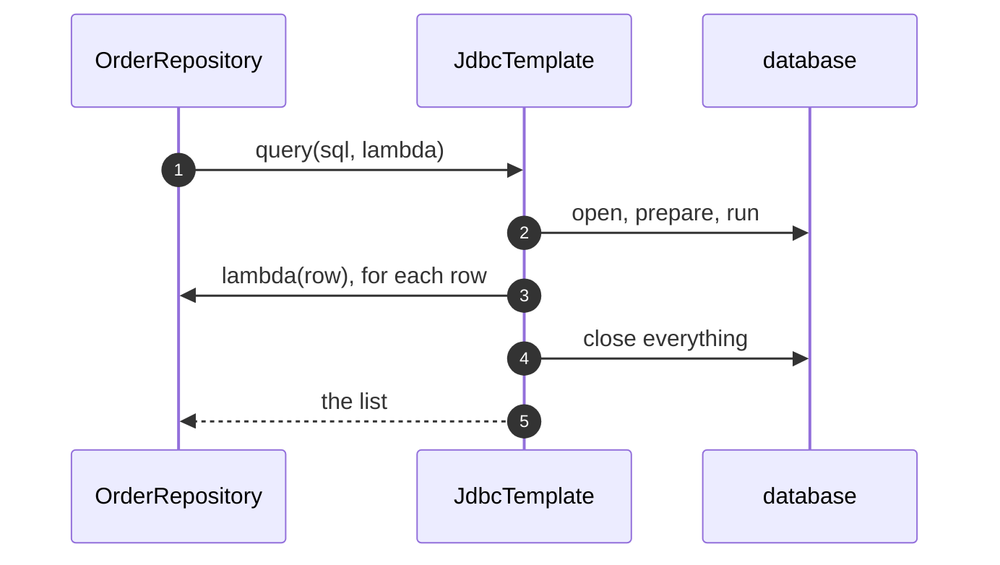
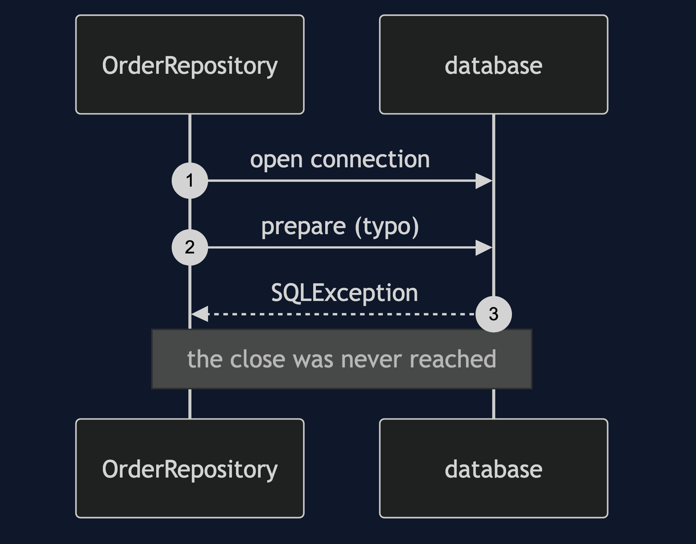
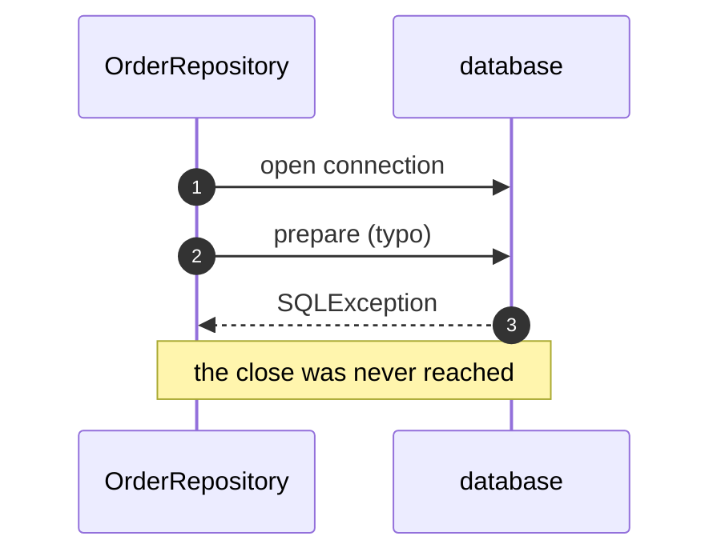

# Template Method with Spring Pattern — UML Sequence Diagrams

Four sequences.

## 1. A Query Through The Template

Mermaid source

```mermaid
sequenceDiagram
    autonumber
    participant R as OrderRepository
    participant T as JdbcTemplate
    participant D as database
    R->>T: query(sql, lambda)
    T->>D: open, prepare, run
    T->>R: lambda(row), for each row
    T->>D: close everything
    T-->>R: the list
```

## 2. A Query By Hand

Mermaid source

```mermaid
sequenceDiagram
    autonumber
    participant R as OrderRepository
    participant D as database
    R->>D: open connection
    R->>D: prepare (typo)
    D-->>R: SQLException
    Note over R,D: the close was never reached
```

