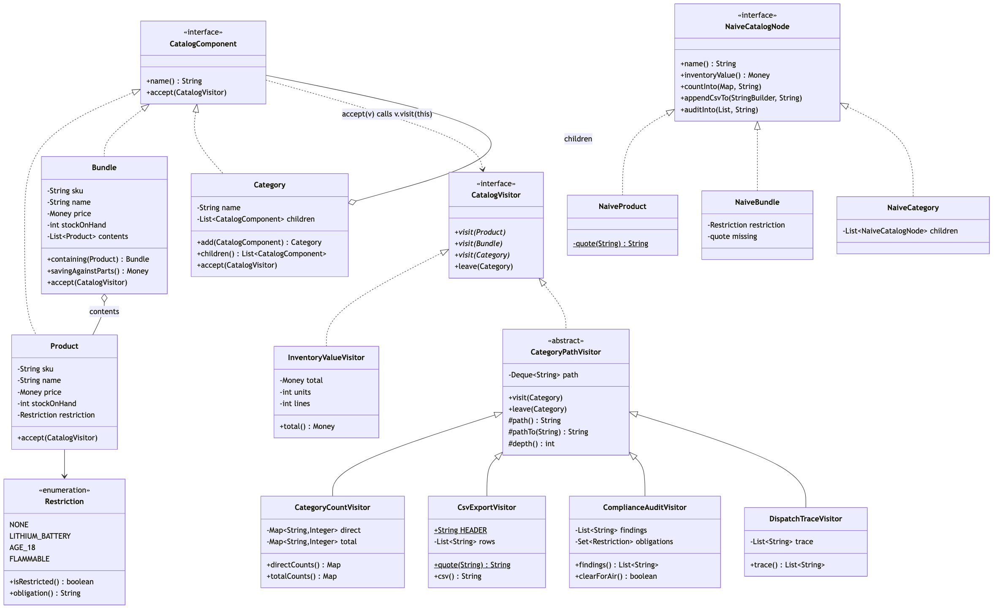
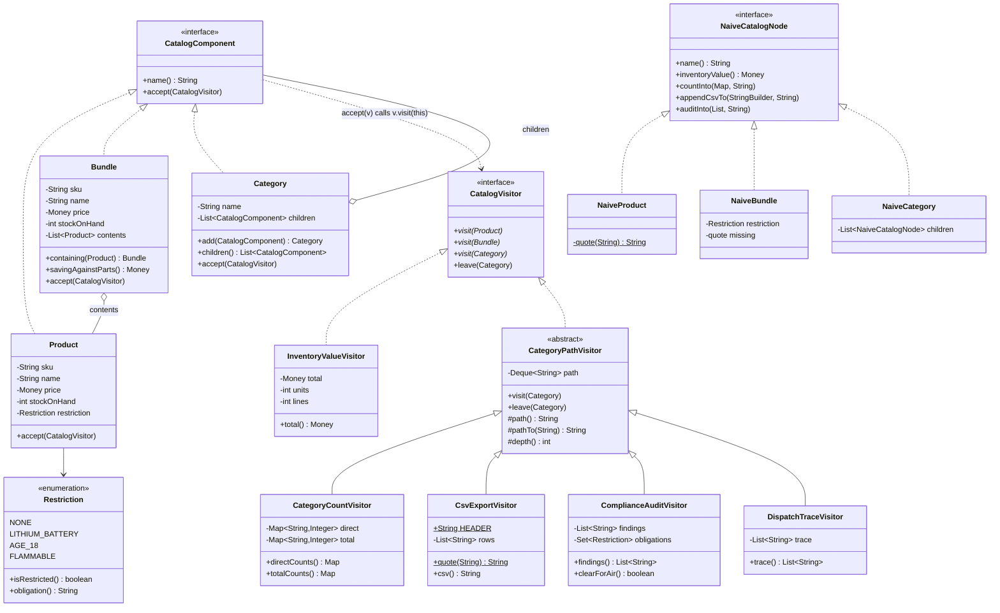

# Class Diagram

## The Two Hierarchies

The shape to take away is that there are **two** of them, side by side, and
one dotted line between.

The left hierarchy is the catalog: three node types under `CatalogComponent`,
and it is finished. The right hierarchy is the reports: six classes under
`CatalogVisitor`, and it grows every month.

`CatalogComponent ..> CatalogVisitor` is the dotted line, and it points the
direction that surprises people. The structure depends on the visitor
interface — a `Product` names `CatalogVisitor` in its signature — while no
node knows any concrete report exists. That is what lets `LowStockVisitor` be
declared inside the demo file and `LongestNameVisitor` inside a test file.

## Count The Boxes On Each Side

| | Node types | Visitors |
| --- | --- | --- |
| Today | 3 | 6 |
| Adding one costs | a method on `CatalogVisitor`, and an edit to all 6 | one new file, and no edit anywhere |

That table is the entire argument for and against this pattern, and it is
worth reading in both directions. The design is cheap along the axis that has
six boxes and expensive along the axis that has three. If your diagram had
those numbers the other way round — many node types, two operations — the
naive design on the right of the picture is the one to choose, and the demo's
section 5 prints the names of the six classes to make the cost concrete
rather than theoretical.

## What Each Visitor Overrides

| Visitor | `visit(Product)` | `visit(Bundle)` | `visit(Category)` | `leave` |
| --- | --- | --- | --- | --- |
| `InventoryValueVisitor` | price × stock | **kit price** × stock | nothing | — |
| `CategoryCountVisitor` | count against the path | count against the path | register the path | pop |
| `CsvExportVisitor` | a row, quoted | a row, quoted, no contents | push the path | pop |
| `ComplianceAuditVisitor` | its own restriction | **every restriction in the box** | push the path | pop |
| `DispatchTraceVisitor` | record | record | record | record |

The two bold cells are the reason `Bundle` is a separate node type rather than
a flag on `Product`. A kit is not worth the sum of its parts, and it is
restricted by things it does not itself declare. Both of those are sentences
that need somewhere to be written, and `visit(Bundle)` is that place. In the
naive design they are branches inside methods that were copied — and
[`problem-statement.md`](problem-statement.md) shows what the copies did.

## `CategoryPathVisitor` Is Not Part Of The Pattern

Four of the six visitors need to know where in the tree they are, and the
bookkeeping is identical every time: push on the way in, pop on the way out.
So there is a base class, and no node knows it exists.

That is worth saying because the diagram makes it look structural. It is not.
A visitor hierarchy is ordinary code and is free to grow a base class the
moment two visitors repeat themselves — `InventoryValueVisitor` sits outside
it because a pound is a pound wherever it is shelved.
