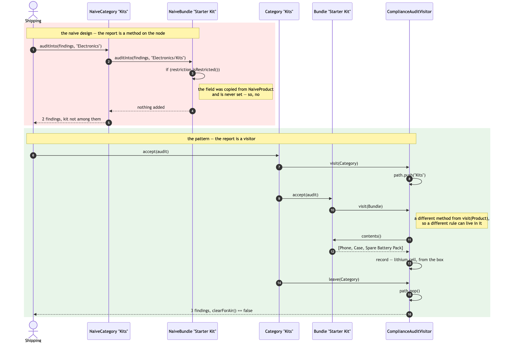
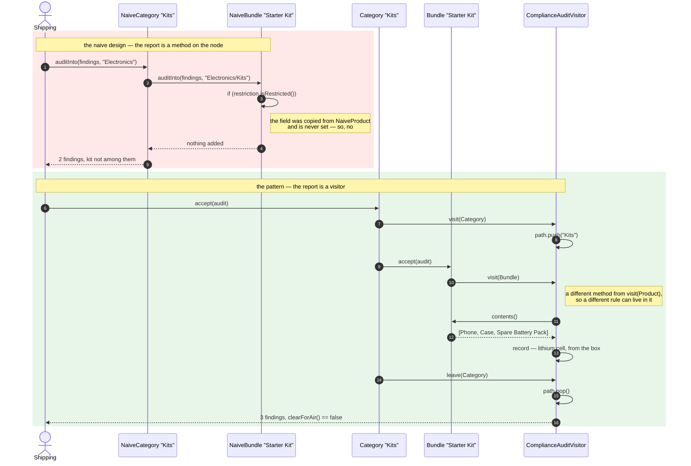
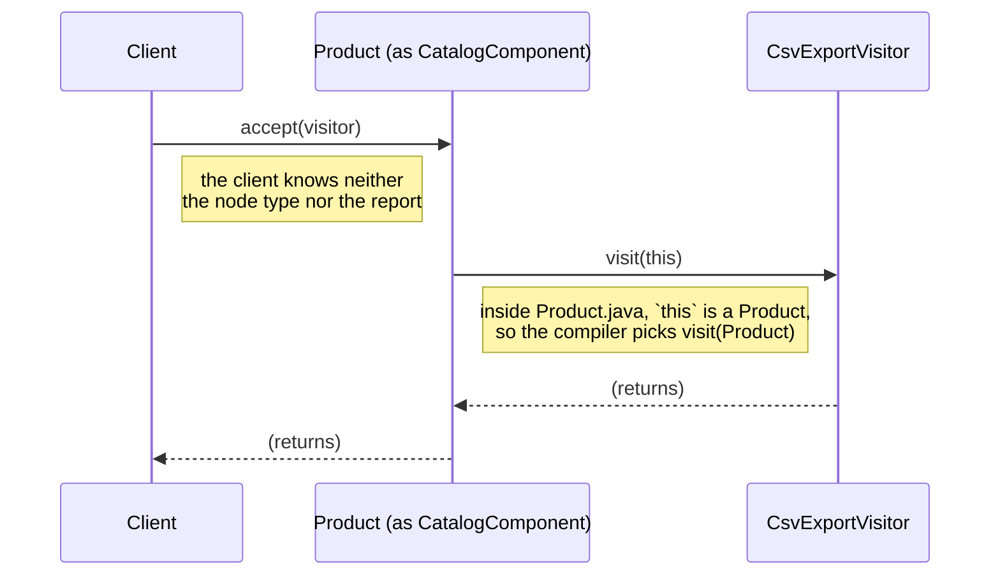
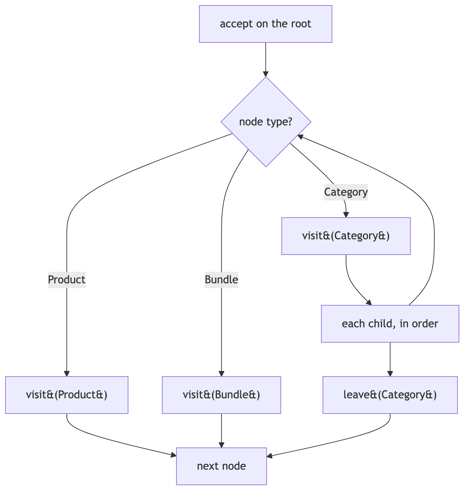

# Sequence Diagram

The interaction, which for a behavioural pattern matters more than the class
diagram. Two blocks: the naive audit missing the cell in the box, and the same
question through a visitor.

## Reading It

**The red block** is four calls, all of them correct. `NaiveCategory` loops
over its children exactly as it should; `NaiveBundle.auditInto` reads a field
and finds nothing. The failure is not in any step — it is that the step asks
the wrong question, and it asks the wrong question because it was copied from
a class where that question was right.

**The green block** is the same catalog and the same question. Step 5 is the
whole pattern: `Kit.accept(audit)` calls `audit.visit(this)`, and because
`this` is a `Bundle` inside `Bundle.java`, the compiler routes it to
`visit(Bundle)` — a *different method* from `visit(Product)`, with room in it
for the rule that a kit inherits what is in the box.

Note what is not in the green block: no `instanceof`, and no loop belonging to
the visitor. Steps 3 and 12 are the path bookkeeping, and they are only
possible because the walk tells the visitor both when it enters a category and
when it leaves.

## The Two Hops, On Their Own

The mechanism, with nothing else in the picture:

Two calls to reach one method. The first is dynamic dispatch on the node — the
JVM picks `Product.accept`. The second is static overload resolution on the
argument — the compiler picked `visit(Product)` when `Product.java` was
compiled. Together they select a method from *two* types at once, which is
what "double dispatch" means and is what Java has no direct syntax for.

It is not obvious code and this project does not pretend otherwise. What it
buys is that the client in the diagram — and every one of the six reports —
never writes a type test.

## The Walk, As A Flow

Where the visitor is taken, once, per report:

```mermaid
flowchart TD
    A[accept on the root] --> B{node type?}
    B -- Product --> P[visit&#40;Product&#41;]
    B -- Bundle --> U[visit&#40;Bundle&#41;]
    B -- Category --> C[visit&#40;Category&#41;]
    C --> D[each child, in order]
    D --> B
    D --> L[leave&#40;Category&#41;]
    P --> E[next node]
    U --> E
    L --> E
```

The diamond is answered by the compiler, not by the visitor, and it is
answered the same way for all six reports because it is answered in
`Category.accept` and in the two `accept` methods on the leaves — once each,
for the whole project.

That is also where the pruning cost comes from. There is no exit from the
diamond that a report controls, so a report wanting only Accessories still
walks all of Electronics and filters. `CatalogVisitorTest.aVisitorSeesTheWholeTree`
asserts exactly that: seven nodes offered, five wanted.
