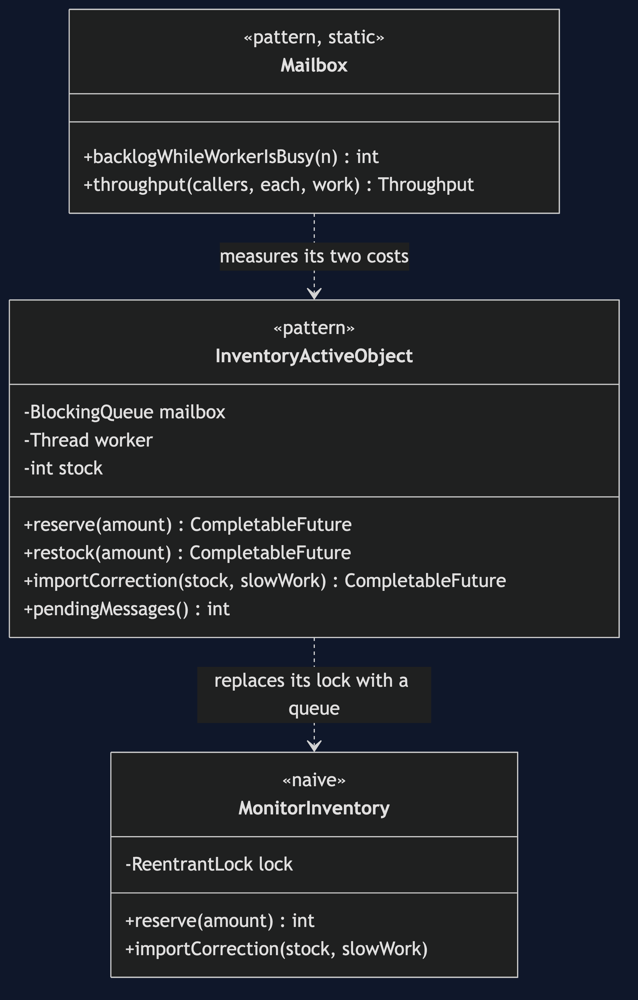
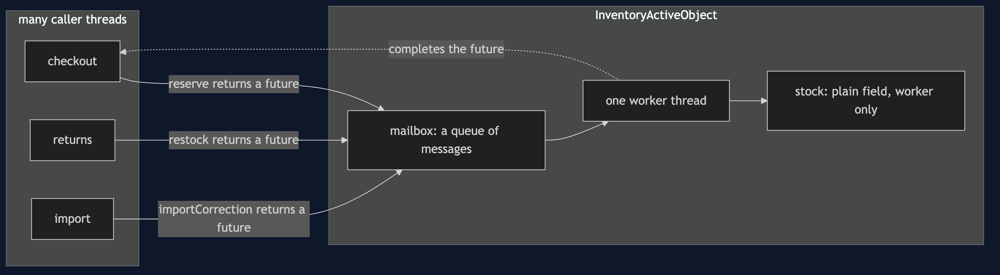
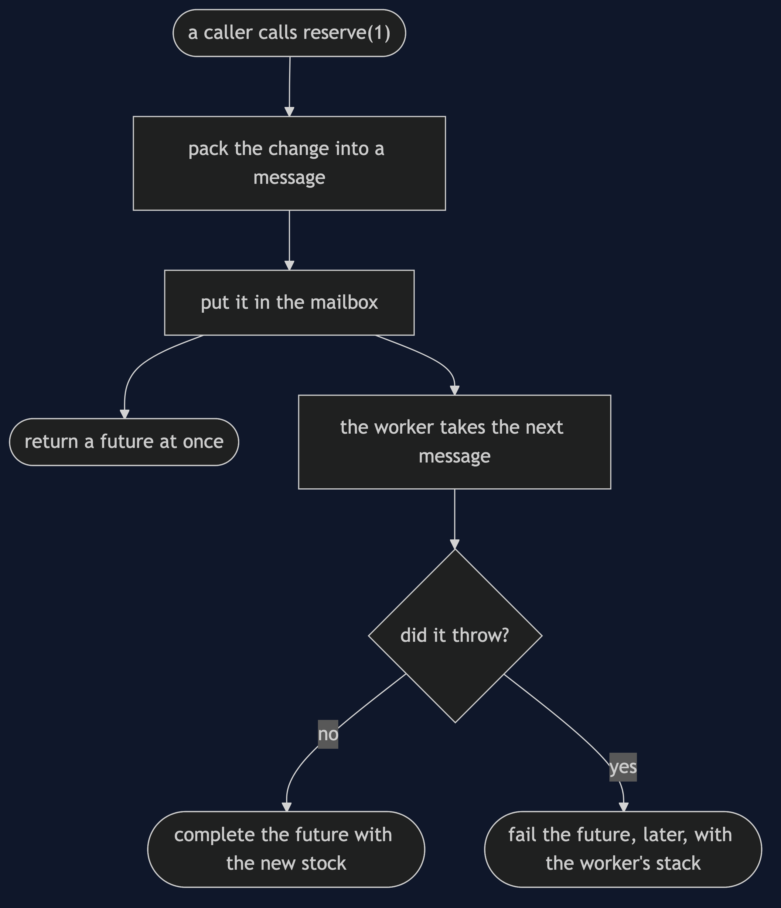
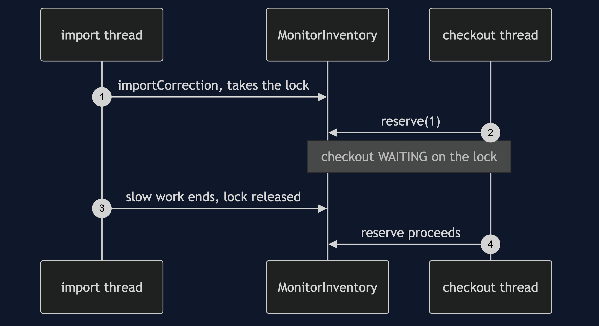
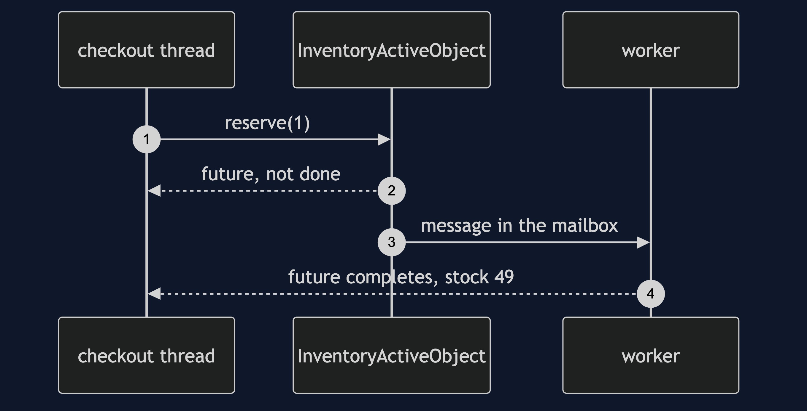
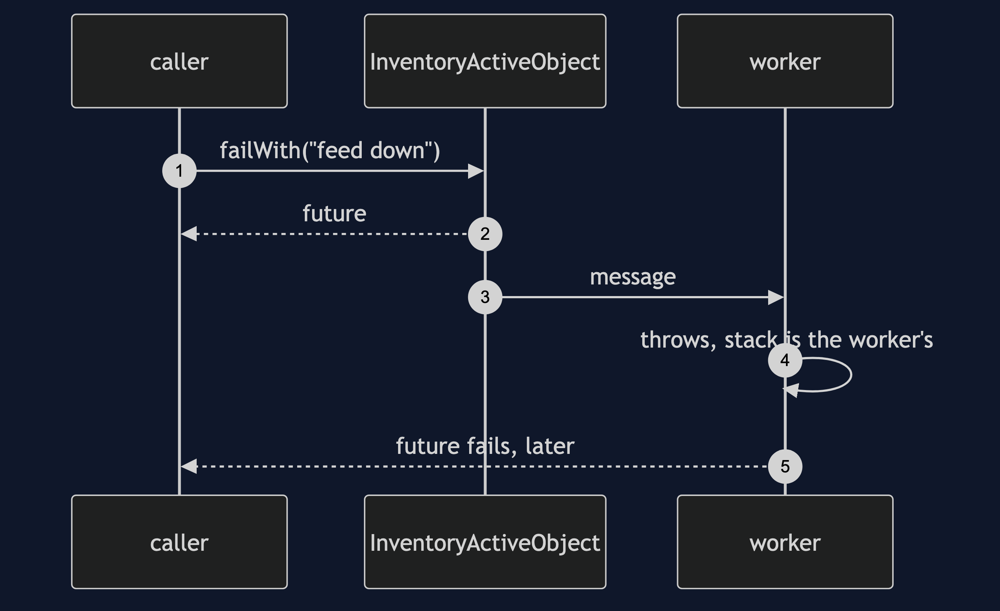
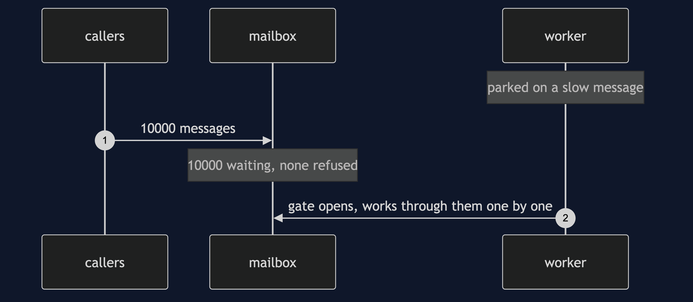

# Active Object Pattern

```
src/main/java/com/jk/explore/activeobject/
├── InventoryDemo.java                composition root — the six acts
│
├── harness/                          ← reused unchanged from §46
│   ├── Gate.java
│   ├── Rendezvous.java
│   └── StepExecutor.java
├── naive/
│   └── MonitorInventory.java          the monitor from §50, and its blocked caller
│
└── pattern/                          ← the real thing
    ├── InventoryActiveObject.java     own thread, own mailbox, no lock
    └── Mailbox.java                   the backlog and the throughput, measured
```

**An object gets its own thread: a call becomes a message that returns a
future at once, and because one thread owns the state, there is no lock at
all.**

This is the sixth and last project in
[concurrency-design-patterns](..), and it is a capstone. It is made of four
earlier projects and re-teaches none of them:

| Part | Taught in |
| --- | --- |
| A queue of messages | [Producer–Consumer](../producer-consumer-pattern) |
| A worker thread | [Thread Pool](../thread-pool-pattern) |
| A future for the answer | [Future/Promise](../future-promise-pattern) |
| State owned by one party | [Monitor Object](../monitor-object-pattern) |

## Run

```bash
./gradlew run
```

Six acts. The rates in act six are real measurements and vary by machine.

```
ONE. A monitor — the checkout thread waits on a slow import.
  the import holds the lock. the checkout thread state: WAITING
  a customer is waiting behind a back-office import.

TWO. An active object — the call returns at once.
  the import is running. reserve(1) has already returned.
  its result is ready yet: false
  import done: stock 50
  reserve done, later, in order: stock 49

THREE. No lock at all — one thread owns the state.
  4 callers x 25000 restocks: stock 100000
  the stock field has no lock and is not volatile.
  only the thread named inventory-worker ever touches it.

FOUR. The mailbox backs up.
  worker busy on one slow message; callers sent 10000 more.
  messages waiting in the mailbox: 10000
  nothing refused them and nothing slowed the callers down.

FIVE. Errors arrive later, from the worker.
  cause: stock feed unavailable [raised on inventory-worker]
  the calling method appears nowhere in that trace: true
  first frame: com.jk.explore.activeobject.pattern.InventoryActiveObject

SIX. One worker is a ceiling.
  every message costs 50 microseconds of work, done by the one worker.
  1 caller:  4000 messages in 201ms, 19832 per second
  4 callers: 4000 messages in 200ms, 19919 per second
  four times the callers, the same rate: the ceiling is the worker, not the callers.

  where this idea went: actors and event loops.
```

## Test

```bash
./gradlew test
```

Five test classes, 11 test methods, most run twenty times via
`@RepeatedTest` — 125 executions, none using `Thread.sleep` to wait for
another thread.

## Technologies and versions

| What | Version | Why it is here |
| --- | --- | --- |
| Java | 21 | The repository standard, via the Gradle toolchain block |
| Gradle | 9.2.1 | The wrapper in this directory; no separate install needed |
| JUnit 5 | 5.10.2 | Test runner; `@RepeatedTest` proves a race rather than merely exercising it |

No frameworks beyond JUnit. Actors and event loops are named and not taught.

## Learning Material

| Document | What it covers |
| --- | --- |
| [`docs/problem-statement.md`](docs/problem-statement.md) | The scenario, and the assembly |
| [`docs/active-object-pattern-explained.md`](docs/active-object-pattern-explained.md) | The pattern and its costs |
| [`docs/determinism.md`](docs/determinism.md) | How each scenario is forced |
| [`docs/class-diagram.md`](docs/class-diagram.md) | The types |
| [`docs/architecture-diagram.md`](docs/architecture-diagram.md) | Callers, mailbox and worker |
| [`docs/data-flow-diagram.md`](docs/data-flow-diagram.md) | One call, start to answer |
| [`docs/sequence-diagram.md`](docs/sequence-diagram.md) | Written for a listener with the screen off |
| [`docs/uml-diagram.md`](docs/uml-diagram.md) | Four sequences |
| [`docs/animation.html`](docs/animation.html) | The six acts in a browser |
| [`docs/prerequisites.md`](docs/prerequisites.md) | What the four earlier projects supply |
| [`docs/session.md`](docs/session.md) | A one-hour taught session |
| [`docs/spec.md`](docs/spec.md) | The generated specification |
| [`docs/youtube.md`](docs/youtube.md) | Title, description and chapters |

### The pattern in one picture



### Where each piece runs



### How one call moves



### Who calls whom, in order


### All four sequences









### Video

Built from [`video/scenes.py`](video/scenes.py) by
[`video/build_video.sh`](video/build_video.sh). The rendered file is not
committed; see the repository README for why.

## When this is too much

For state that rarely changes, a monitor is simpler. An active object earns
its place when callers must not wait, or when the work is slow.

## Where this sits

This is the last of six projects in [`concurrency-design-patterns`](..).

## Also available with a framework

[Active Object with Spring Pattern](../active-object-with-spring-pattern) reruns this idea on a real framework, and shows what the framework adds and where it can undo the pattern. Watch this project first.
