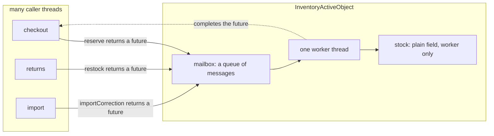

# Active Object Pattern — Architecture Diagram

Many caller threads on one side, one worker on the other, and a mailbox
between them.

Mermaid source

```mermaid
flowchart LR
    subgraph Callers["many caller threads"]
        C1["checkout"]
        C2["returns"]
        C3["import"]
    end
    subgraph AO["InventoryActiveObject"]
        Box["mailbox: a queue of messages"]
        W["one worker thread"]
        S["stock: plain field, worker only"]
    end
    C1 -->|reserve returns a future| Box
    C2 -->|restock returns a future| Box
    C3 -->|importCorrection returns a future| Box
    Box --> W
    W --> S
    W -.->|completes the future| C1
```

