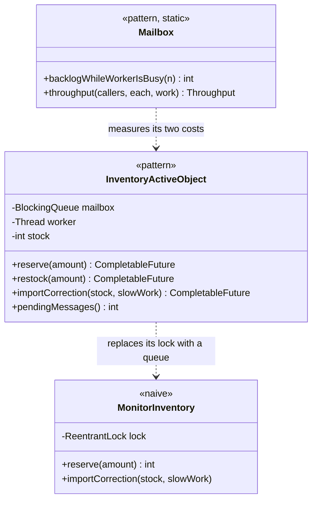

# Active Object Pattern — Class Diagram

`InventoryActiveObject` is the assembly: a mailbox, a worker thread, and a
`CompletableFuture` returned for every call. The state field is private to
the worker.

Mermaid source

## Reading The Diagram

The `stock` field has no lock beside it. That absence is the pattern.
