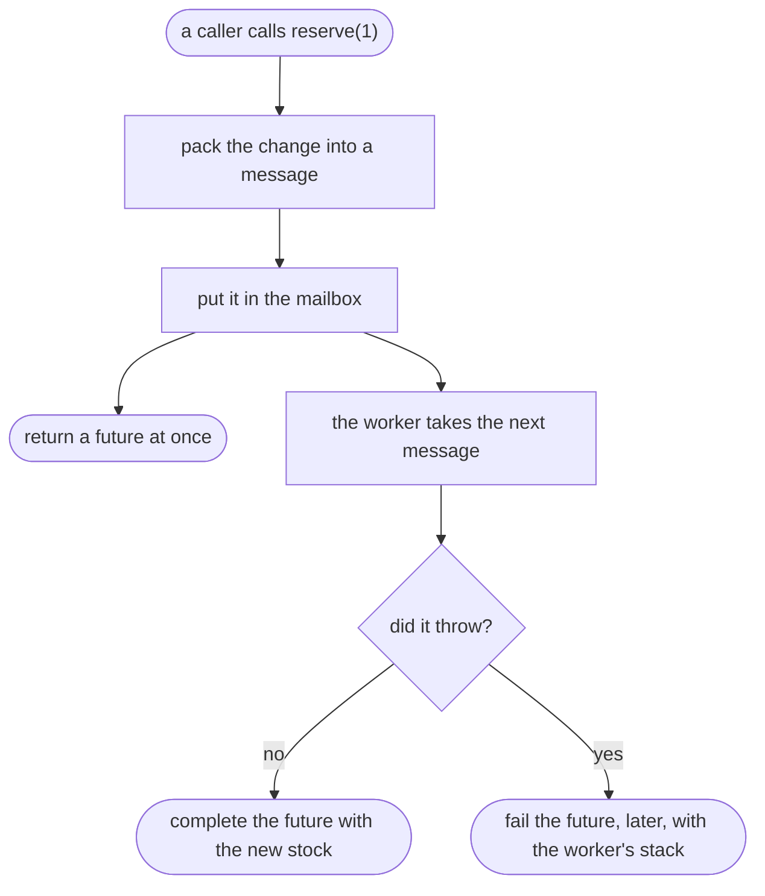

# Active Object Pattern — Data Flow Diagram

One call, from the caller's method to the worker's answer.

Mermaid source

```mermaid
flowchart TD
    Call(["a caller calls reserve(1)"])
    Pack["pack the change into a message"]
    Put["put it in the mailbox"]
    Ret(["return a future at once"])
    Take["the worker takes the next message"]
    Ok{"did it throw?"}
    Done(["complete the future with the new stock"])
    Fail(["fail the future, later, with the worker's stack"])
    Call --> Pack --> Put --> Ret
    Put --> Take --> Ok
    Ok -- no --> Done
    Ok -- yes --> Fail
```

