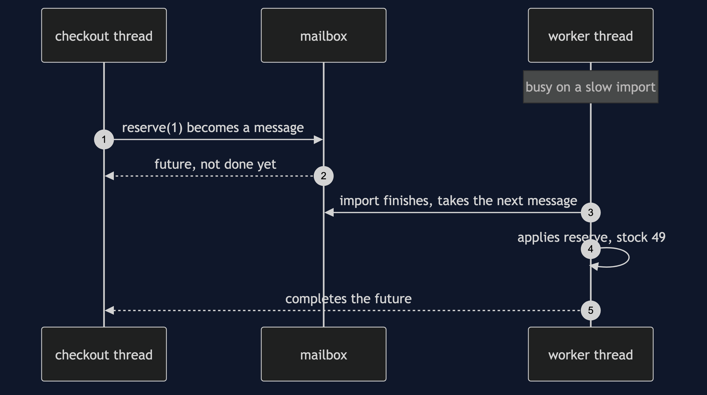
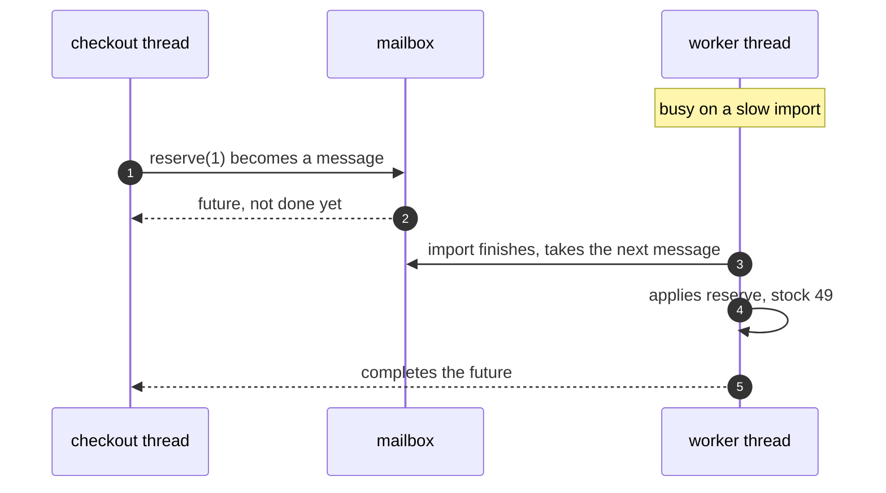

# Active Object Pattern — Sequence Diagram

Written for a listener with the screen off.

Say it in words. The worker is busy on a slow import. The checkout thread
calls reserve. The call packs the request into a message, drops it in the
mailbox, and returns a future straight away. The future is not done. The
import finishes, the worker takes the reserve message next, applies it, and
completes the future. The checkout thread, holding that future, now sees the
answer.

Mermaid source

The load-bearing sentence: **the call returned before the work started.**
