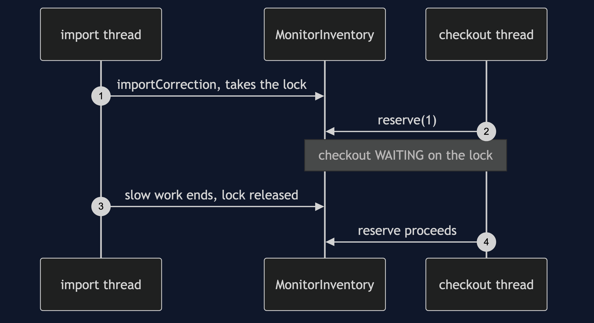
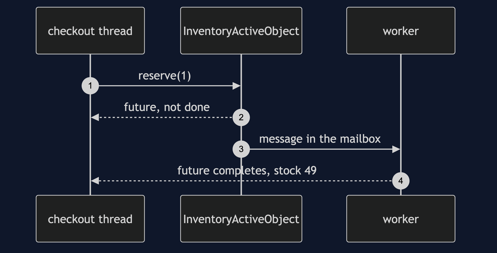
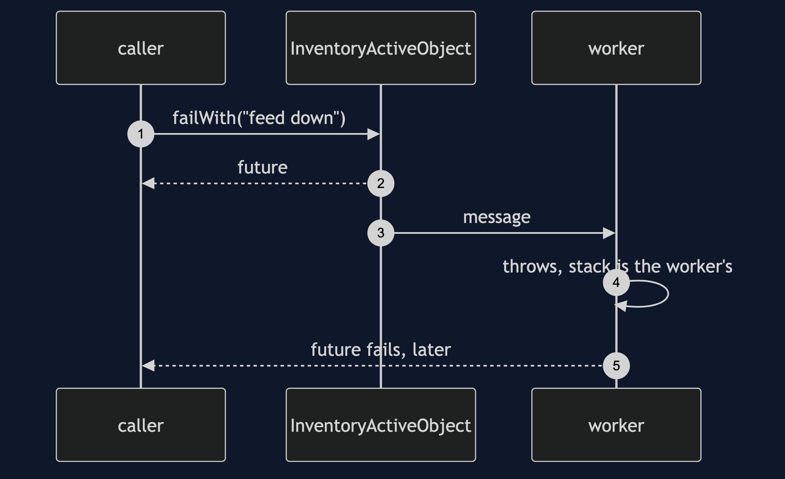
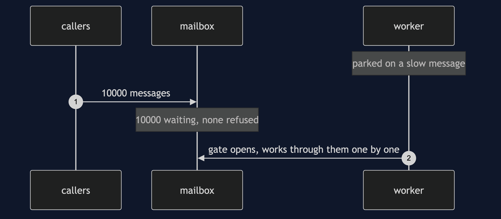

# Active Object Pattern — UML Sequence Diagrams

Four sequences: a monitor blocking, the call that returns first, an error
from the worker, and the mailbox backing up.

## 1. A Monitor Blocks The Caller

## 2. The Call That Returns First

## 3. An Error From The Worker

## 4. The Mailbox Backs Up

