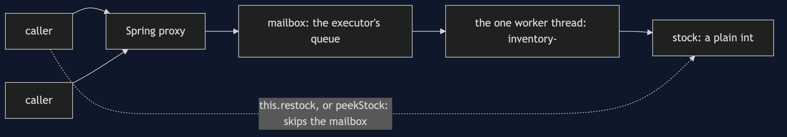

# Active Object with Spring Pattern

```
src/main/java/com/jk/explore/activeobjectspring/
├── InventoryApplication.java        the Spring Boot entry point and the six acts
├── InventoryConfig.java             the mailbox: one thread and a queue
├── InventoryService.java            the active object: a plain int, and @Async methods
└── Gate.java                        the harness's gate, copied from the partner
```

**An `@Async` bean on a one-thread executor is an active object. The state is a plain field, and it is safe only for the calls that go through the proxy.**

This project is the framework version of [Active Object](../active-object-pattern). That project built the mechanism by hand. This one shows the same idea inside Spring Boot. It does not re-teach the pattern. It shows what Spring Boot adds, the failures that are its own, and what it costs.

## Run

```bash
./gradlew run
```

Six acts. The partner project, Active Object, built the mechanism by hand. Here the same idea runs through Spring Boot, and every count comes from real output.

```
ACTIVE OBJECT WITH SPRING — one thread, one mailbox

ONE. A bean on a one-thread executor: state with no lock.
  4 callers x 5000 restocks: stock 20000
  the stock field is a plain int: no lock, not volatile. every change ran on the inventory- thread.

TWO. The mailbox is the executor's queue, and it has the partner's costs.
  the worker is busy on one slow message. callers send 10000 more.
  messages waiting in the mailbox: 10000. nothing refused them.
  with a mailbox of 3: the fourth message waiting is refused with TaskRejectedException. that is a bound.

THREE. One call that skips the proxy breaks the guarantee.
  the worker read the stock (0) and is holding it. a caller adds 5 through this, on its own thread: stock 5.
  the worker then writes 0 + 10. final stock: 10, not 15. five items vanished.
  with two threads changing a plain field, the lock-free design is gone, and nothing complains.

FOUR. A read that skips the mailbox sees the past.
  a restock of 5 has been sent, and is waiting its turn behind a slow message.
  a getter that reads the field directly, from the caller's thread, says: 0.
  a read sent as a message, behind the restock, says: 5.
  the direct read raced the worker, and lost. in an active object, reads are messages too.

FIVE. Errors arrive later, from the worker.
  cause: stock feed unavailable [raised on inventory-1]
  the calling method appears nowhere in that trace: true.

SIX. One worker is a ceiling.
  every message costs 50 microseconds of work, all on the one inventory- thread.
  1 caller:  19258 per second
  4 callers: 19480 per second
  four times the callers, the same rate: the ceiling is the worker, as in the partner project.
  verdict: an @Async bean on a one-thread executor is an active object. route every call, reads included, through the proxy,
  and bound the mailbox. where you have met this: a single-thread executor and @Async("name").
```

## Test

```bash
./gradlew test
```

2 test classes, 8 test methods, offline, with each Spring context started inside the test, and no server.

## Technologies and versions

| What | Version | Why it is here |
| --- | --- | --- |
| Java | 21 | The repository standard, via the Gradle toolchain block |
| Gradle | 9.2.1 | The wrapper in this directory; no separate install needed |
| Spring Boot | 4.1.1 | The container, `@Async` and the executor |
| JUnit 5 | 5.10.2 | Test runner |

See [`docs/dependencies.md`](docs/dependencies.md).

## Learning Material

| Document | What it covers |
| --- | --- |
| [`docs/problem-statement.md`](docs/problem-statement.md) | The partner's inventory, and what is new |
| [`docs/active-object-with-spring-pattern-explained.md`](docs/active-object-with-spring-pattern-explained.md) | A bean on one thread, and the two ways its guarantee breaks |
| [`docs/class-diagram.md`](docs/class-diagram.md) | The types |
| [`docs/architecture-diagram.md`](docs/architecture-diagram.md) | Callers, a mailbox and one worker |
| [`docs/data-flow-diagram.md`](docs/data-flow-diagram.md) | A call and a read, through the proxy and around it |
| [`docs/sequence-diagram.md`](docs/sequence-diagram.md) | Written for a listener with the screen off |
| [`docs/uml-diagram.md`](docs/uml-diagram.md) | Four sequences |
| [`docs/animation.html`](docs/animation.html) | The six acts in a browser |
| [`docs/prerequisites.md`](docs/prerequisites.md) | What you need to know |
| [`docs/session.md`](docs/session.md) | A one-hour taught session |
| [`docs/spec.md`](docs/spec.md) | The generated specification |
| [`docs/youtube.md`](docs/youtube.md) | Title, description and chapters |
| [`docs/dependencies.md`](docs/dependencies.md) | What Spring Boot is, what it costs, and that skipping this project loses none of the pattern |

### The pattern in one picture


### Where each piece sits



### How one request moves


### Who calls whom, in order


### All four sequences


### Video

Built from [`video/scenes.py`](video/scenes.py) by
[`video/build_video.sh`](video/build_video.sh). The rendered file is not
committed; see the repository README for why.

## Where you have already met this

A single-thread executor named for the thing it protects, and every `@Async("name")` method that uses it. Actor libraries take this idea much further.

## When this is too much

For state that changes rarely, a plain synchronized method is simpler. An active object earns its place when callers must not wait.

## Where this sits

This project pairs with [Active Object](../active-object-pattern), and is a framework version in [`concurrency-design-patterns`](..).
