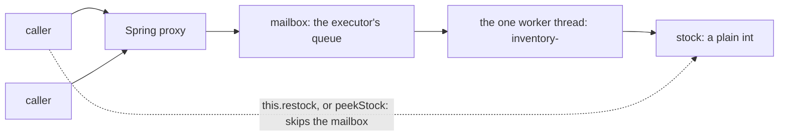

# Active Object with Spring Pattern — Architecture Diagram

Callers put messages in the mailbox. One worker takes them, and owns the state.

Mermaid source

```mermaid
flowchart LR
    C1["caller"] --> P["Spring proxy"]
    C2["caller"] --> P
    P --> M["mailbox: the executor's queue"]
    M --> W["the one worker thread: inventory-"]
    W --> S["stock: a plain int"]
    C1 -.->|this.restock, or peekStock: skips the mailbox| S
```

