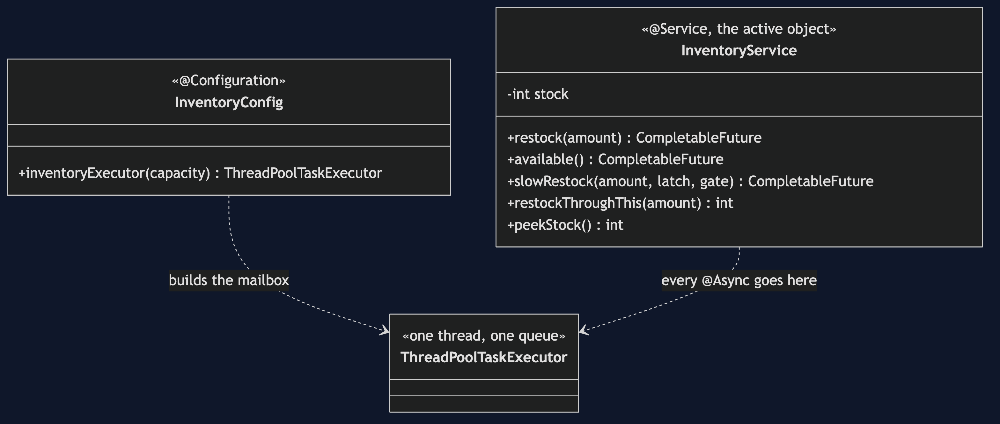
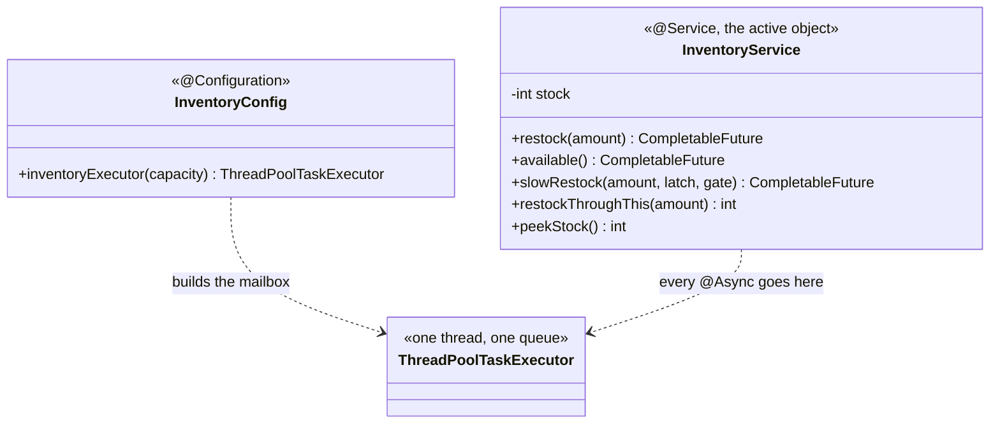

# Active Object with Spring Pattern — Class Diagram

`InventoryService` is a plain field and `@Async` methods. `InventoryConfig` is the one-thread mailbox.

Mermaid source

```mermaid
classDiagram
    class InventoryService {
        <<@Service, the active object>>
        -int stock
        +restock(amount) CompletableFuture
        +available() CompletableFuture
        +slowRestock(amount, latch, gate) CompletableFuture
        +restockThroughThis(amount) int
        +peekStock() int
    }
    class InventoryConfig {
        <<@Configuration>>
        +inventoryExecutor(capacity) ThreadPoolTaskExecutor
    }
    class ThreadPoolTaskExecutor {
        <<one thread, one queue>>
    }
    InventoryConfig ..> ThreadPoolTaskExecutor : builds the mailbox
    InventoryService ..> ThreadPoolTaskExecutor : every @Async goes here
```

