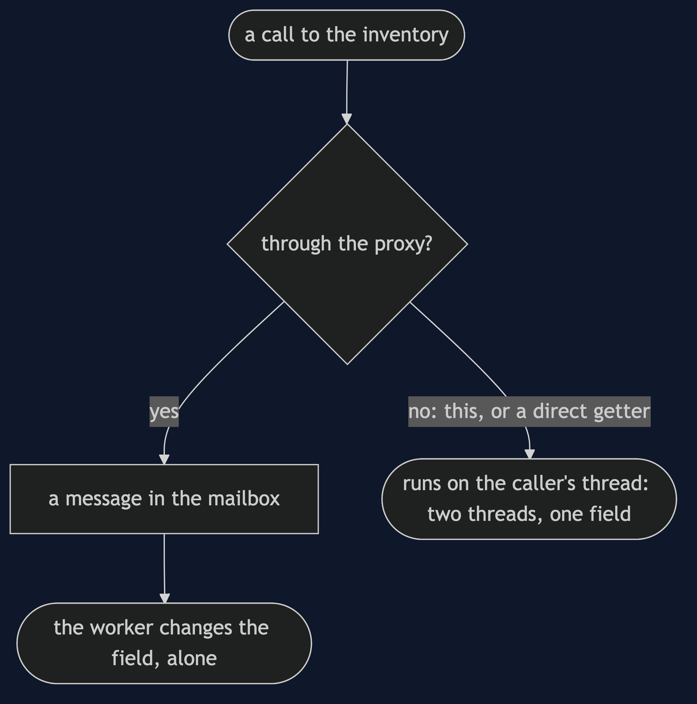
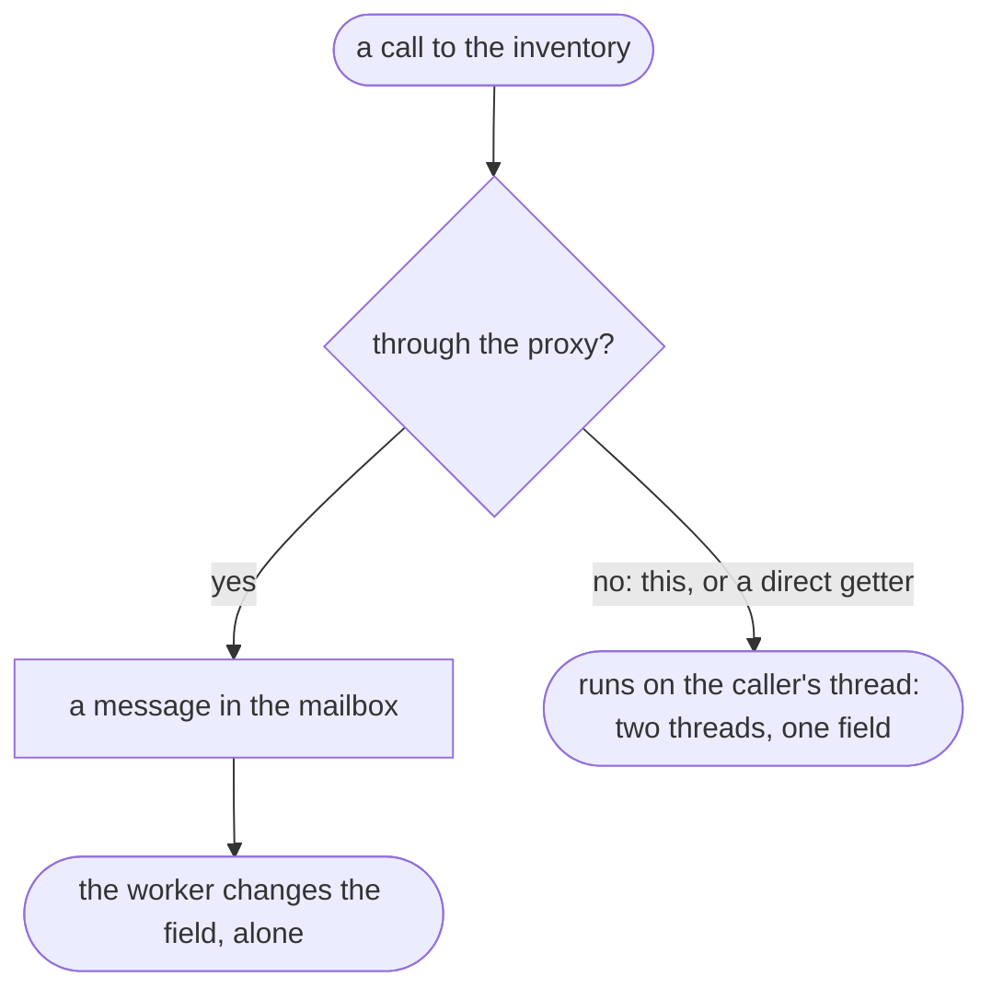

# Active Object with Spring Pattern — Data Flow Diagram

A call: through the proxy to the worker, or around it to the field.

Mermaid source

```mermaid
flowchart TD
    Call(["a call to the inventory"])
    Via{"through the proxy?"}
    Msg["a message in the mailbox"]
    Worker(["the worker changes the field, alone"])
    Skip(["runs on the caller's thread: two threads, one field"])
    Call --> Via
    Via -- yes --> Msg --> Worker
    Via -- no: this, or a direct getter --> Skip
```

