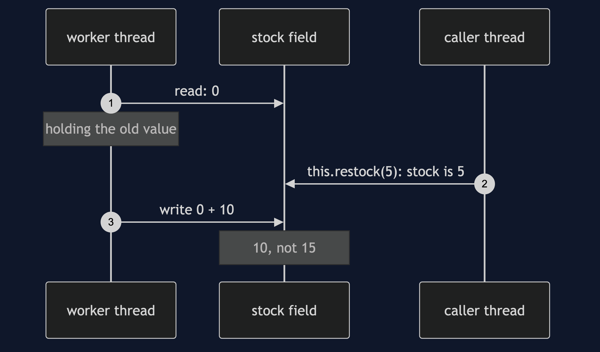
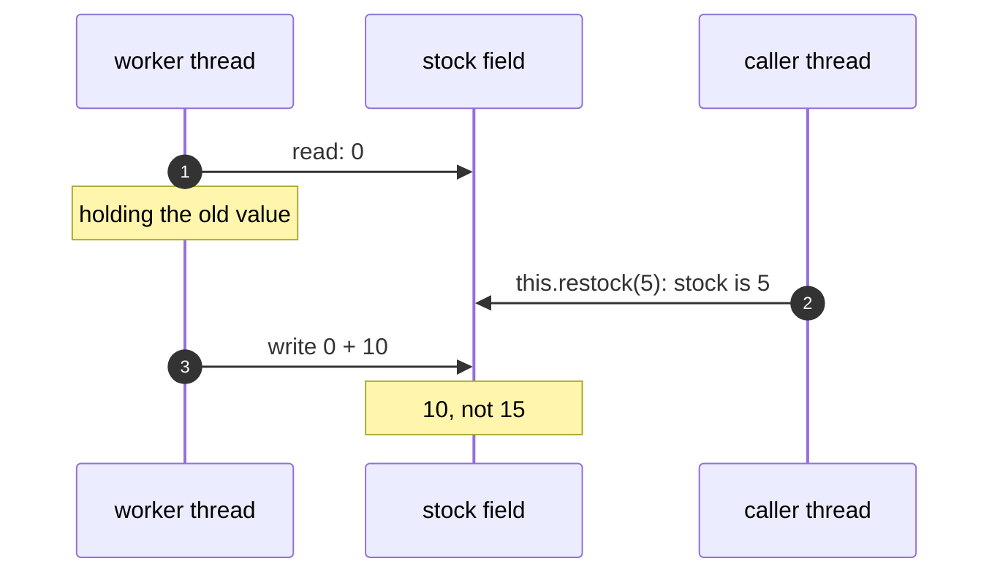

# Active Object with Spring Pattern — Sequence Diagram

Written for a listener with the screen off.

Say it in words. The worker has read the stock, which is zero, and is holding it while it does a slow step. A caller then adds five through this. That call skips Spring's proxy, so it runs right there on the caller's own thread, and changes the field to five. The worker finishes its slow step and writes what it read, zero, plus ten. The five is gone. Nothing failed, and nothing was logged.

Mermaid source

The load-bearing sentence: **the lock-free design holds only for the calls that go through the proxy.**
