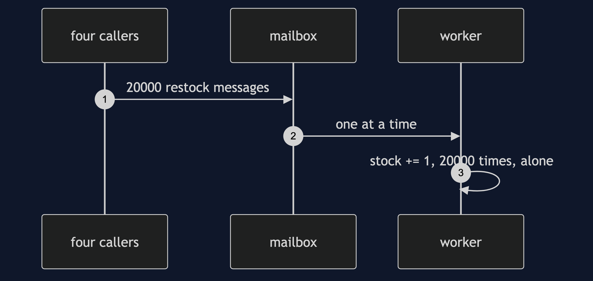
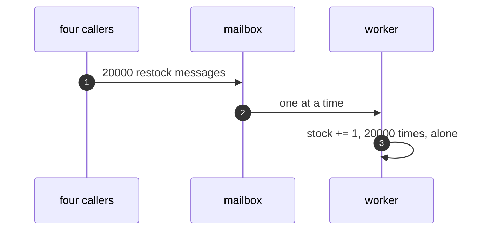
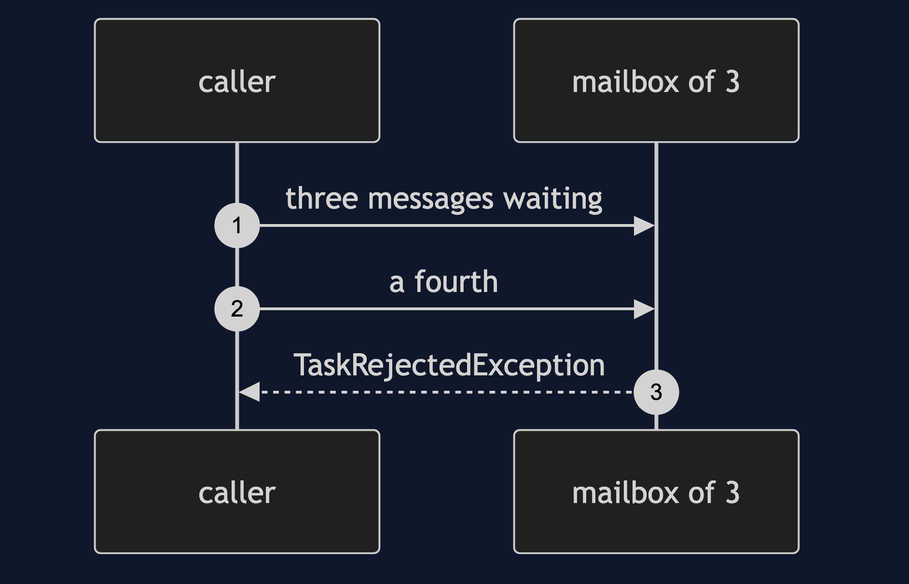
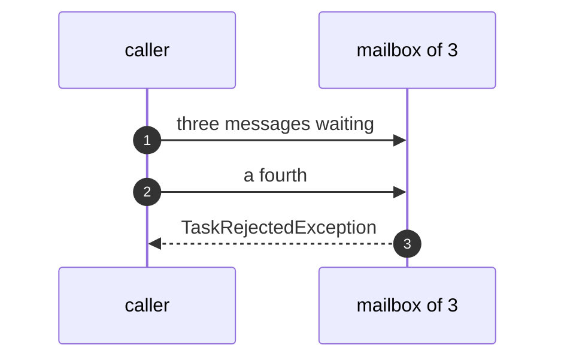
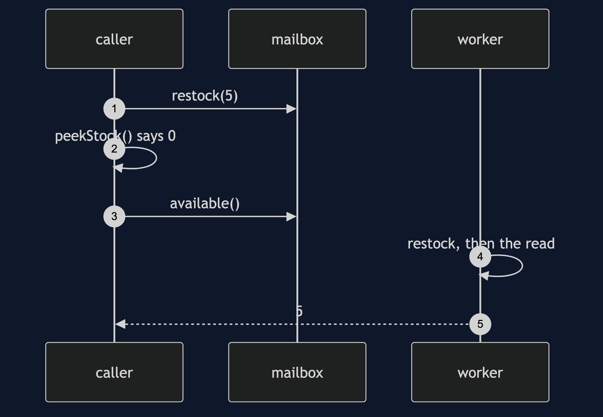
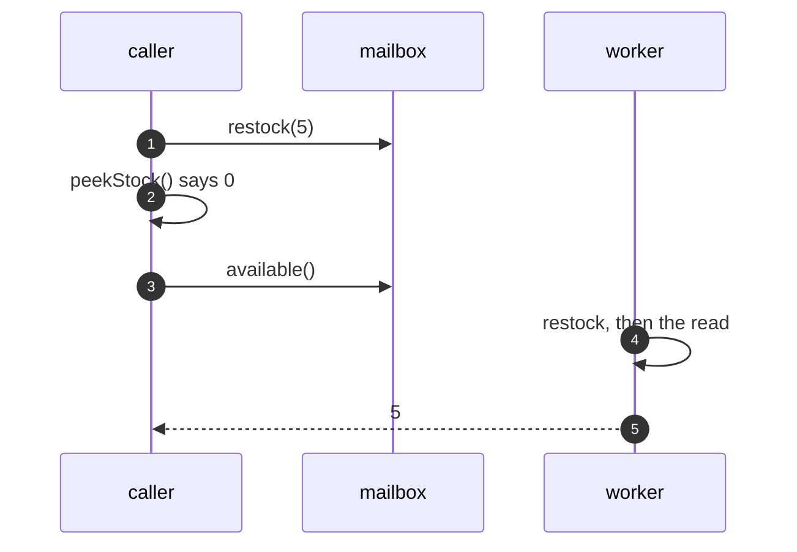
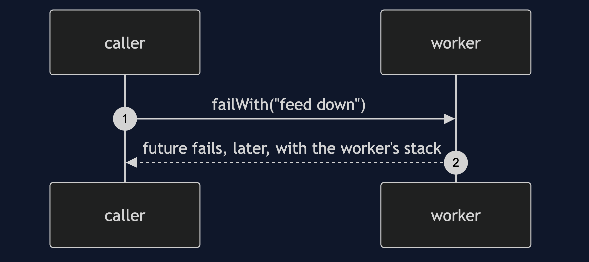
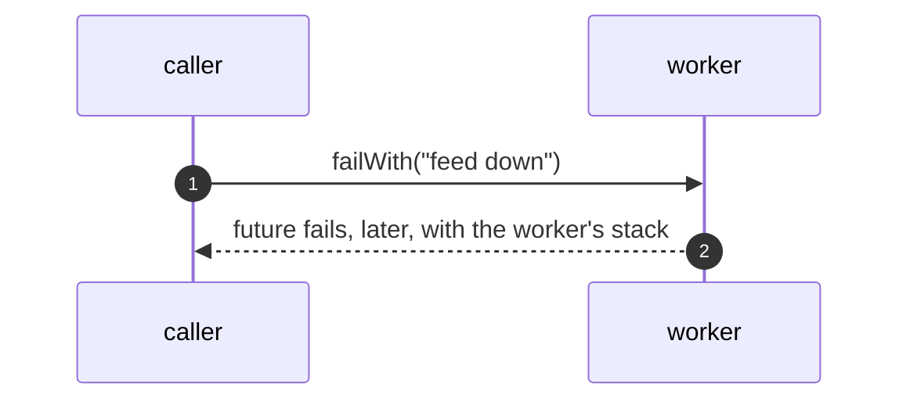

# Active Object with Spring Pattern — UML Sequence Diagrams

Four sequences.

## 1. One Thread, No Lock

Mermaid source

## 2. A Bounded Mailbox

Mermaid source

## 3. A Read As A Message

Mermaid source

## 4. An Error From The Worker

Mermaid source

