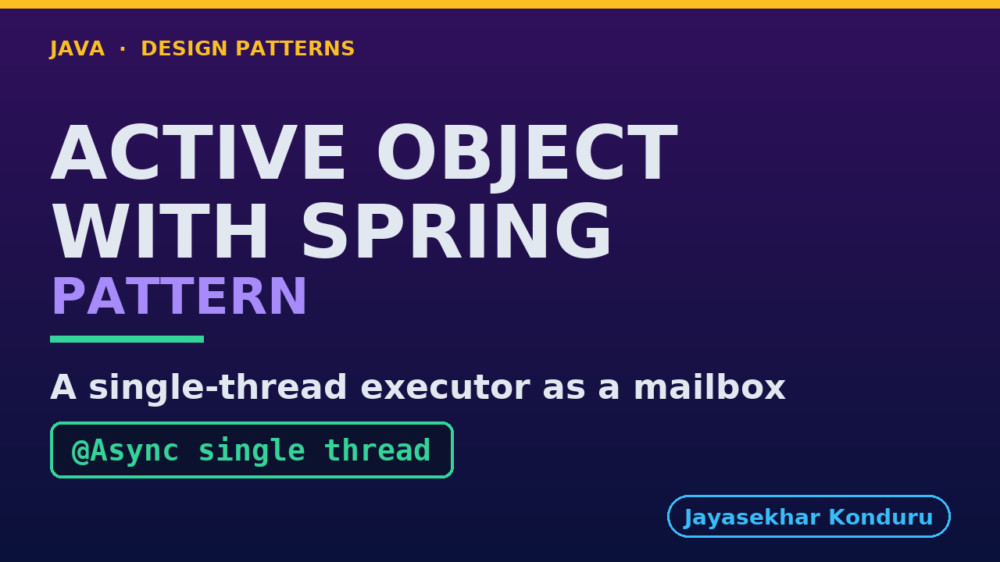

# YouTube — Active Object With Spring Pattern

Everything needed to publish `video/active-object-with-spring-pattern-explained.mp4`. Copy the fields straight out of this file.

Chapter timings are generated from the video's `.srt`. Re-run `python3 docs/make_youtube_docs.py active-object-with-spring` after any change to the narration, or they will be wrong.

## Title

```
Active Object with Spring - One Thread, One Mailbox
```

51 characters — under the 60 YouTube shows before truncating in search results.

## Description

The first two lines are what a viewer sees above the fold, so they carry the hook rather than the boilerplate.

```
Active Object pattern in Java: each method call becomes a message in a queue, and one private thread works through the queue, so callers never wait and the data needs no lock. Explained with Spring Boot, using the same shop stock. We build it from a Spring bean and a one-thread executor: each call drops a message into a mailbox and returns at once, and one worker owns the data, so there is no lock, like a post box emptied by a single postal worker. Then we hear the two ways the guarantee breaks, a call that skips the proxy and a read that skips the mailbox, along with errors that arrive later and the ceiling of one worker. The guarantee only holds for calls that go through the queue.

CHAPTERS
00:00 Introduction
00:55 The Partner Project
01:22 Before The First Line
01:47 No Lock At All
02:12 The Mailbox
02:35 A Call That Skips The Proxy
03:11 A Read That Skips The Mailbox
03:36 Errors Arrive Later
03:57 One Worker Is A Ceiling
04:24 The Verdict
04:39 How To Recognise It
04:59 Where You Have Met This
05:09 What Was Used
05:19 What Is Real Here
05:33 When This Is Too Much
05:44 Thanks for Watching

SOURCE CODE, WRITTEN NOTES AND AN INTERACTIVE ANIMATION
https://github.com/jk-boot-up/java-design-patterns/tree/main/gradle-java/concurrency-design-patterns/active-object-with-spring-pattern

WHAT YOU NEED FIRST
Java 21 and a working knowledge of classes and interfaces. No prior design-pattern knowledge is assumed. The full prerequisites are in docs/prerequisites.md in the repository.
```

## Chapters

YouTube renders these as chapters only if there are at least three and the first is at `00:00`.

```
00:00 Introduction
00:55 The Partner Project
01:22 Before The First Line
01:47 No Lock At All
02:12 The Mailbox
02:35 A Call That Skips The Proxy
03:11 A Read That Skips The Mailbox
03:36 Errors Arrive Later
03:57 One Worker Is A Ceiling
04:24 The Verdict
04:39 How To Recognise It
04:59 Where You Have Met This
05:09 What Was Used
05:19 What Is Real Here
05:33 When This Is Too Much
05:44 Thanks for Watching
```

## Tags

```
active object spring, actor model java, spring async, design patterns, java design patterns, gang of four, java 21, software design, clean code, object oriented design, java tutorial, ecommerce, programming tutorial
```

215 characters, under YouTube's 500 limit.

## Thumbnail



**Upload `docs/thumbnail.png`** — 1280×720, the size YouTube recommends, generated by `docs/make_thumbnails.py`. It is deliberately not the same image as the video's opening frame: a thumbnail is judged at about 360 pixels wide in a search result, so this one carries only the pattern name, one line of promise and one short piece of code, each set large enough to survive the shrink.

`video/poster.png` is the 1920×1080 opening frame, produced by the video build. It stays in the repository as the title card; it is not what gets uploaded.

YouTube will not pick the thumbnail up on its own — upload it under **Details → Thumbnail → Upload file**. A custom thumbnail requires a verified channel.

## Upload checklist

- [ ] Upload `video/active-object-with-spring-pattern-explained.mp4` (1080p, H.264, 30 fps, AAC 48 kHz — already YouTube's recommended settings, no re-encode needed)
- [ ] Set the video language to **English** first, or the subtitle option may not appear
- [ ] Add subtitles: *Video elements → Add subtitles → Upload file → With timing* → `video/active-object-with-spring-pattern-explained.srt`
- [ ] Upload `docs/thumbnail.png` as the thumbnail — do not let YouTube auto-pick a frame
- [ ] Paste the title, description and tags from above
- [ ] Add to the **Java Design Patterns** playlist, in learning order
- [ ] Wait for 1080p processing before sharing the link — code slides are unreadable at 360p

## Cards and end screen

End screen links to whichever pattern video goes up next — set it at upload time rather than assuming an order.

Add a card partway through pointing at the playlist, so a viewer who arrives at this pattern from search can find the rest of the series.

## Runtime

Approximately 06:22, narrated at 145 words per minute.
