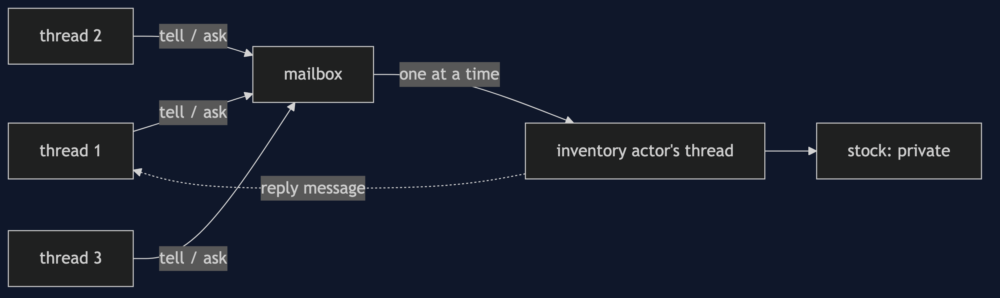
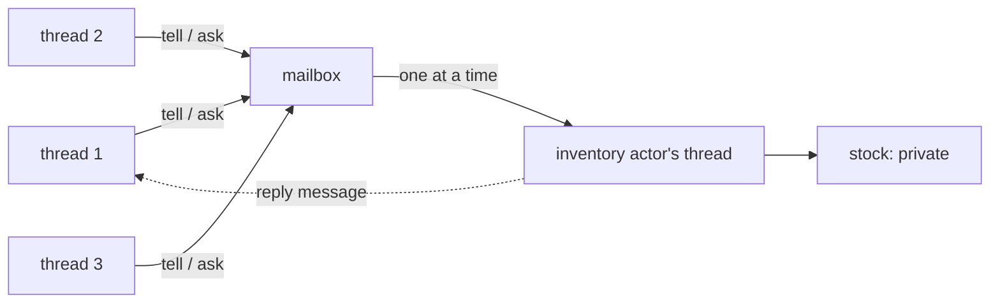

# Actor Pattern — Architecture Diagram

Senders only know the mailbox. The actor's thread is the only one that touches the state.

Mermaid source

```mermaid
flowchart LR
    S1["thread 1"] -->|tell / ask| M["mailbox"]
    S2["thread 2"] -->|tell / ask| M
    S3["thread 3"] -->|tell / ask| M
    M -->|one at a time| A["inventory actor's thread"]
    A --> ST["stock: private"]
    A -.->|reply message| S1
```

