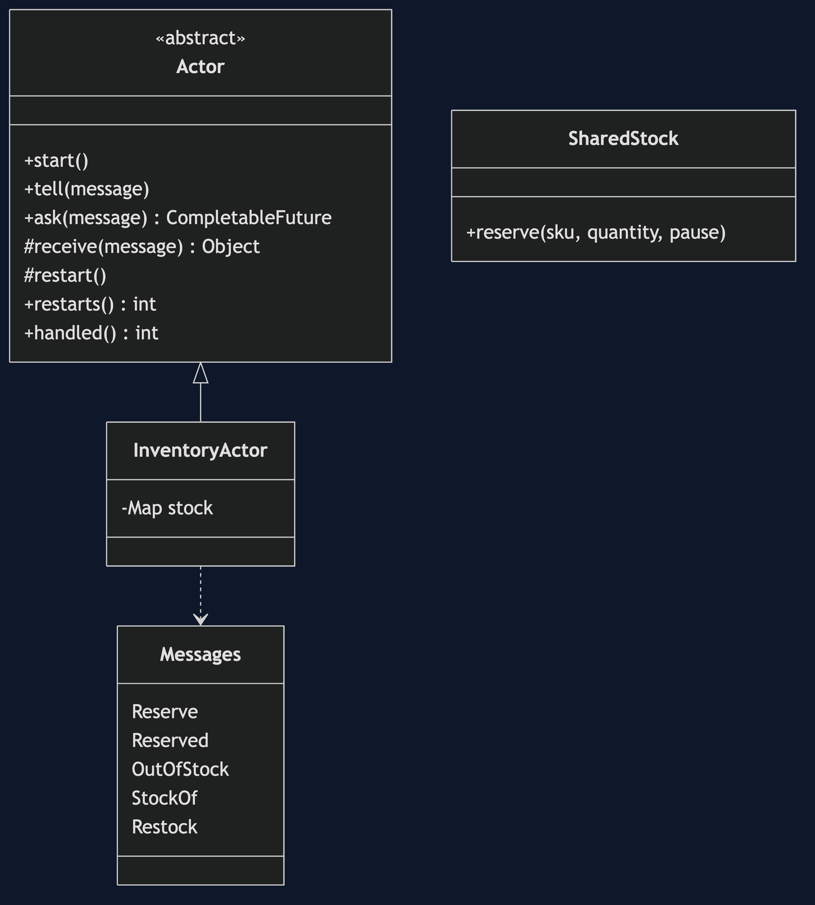
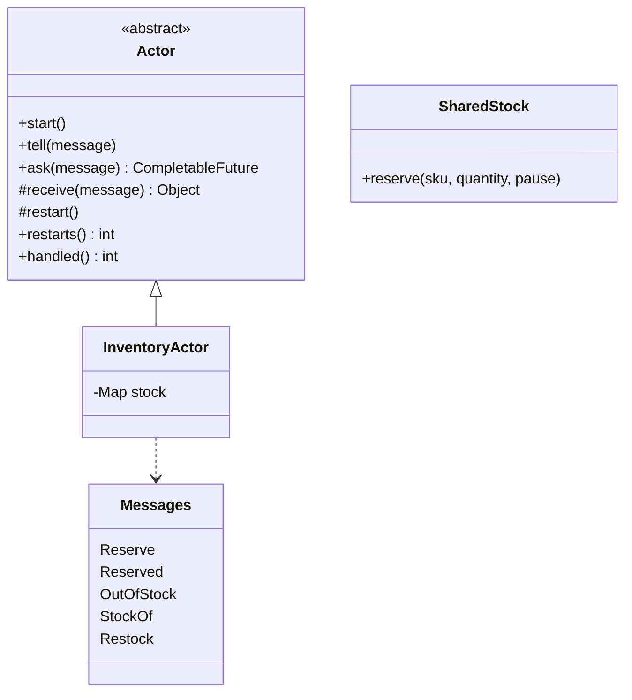

# Actor Pattern — Class Diagram

An actor owns state and a mailbox. Messages are records.

Mermaid source

```mermaid
classDiagram
    class Actor {
        <<abstract>>
        +start()
        +tell(message)
        +ask(message) CompletableFuture
        #receive(message) Object
        #restart()
        +restarts() int
        +handled() int
    }
    class InventoryActor {
        -Map stock
    }
    class Messages {
        Reserve
        Reserved
        OutOfStock
        StockOf
        Restock
    }
    class SharedStock {
        +reserve(sku, quantity, pause)
    }
    Actor <|-- InventoryActor
    InventoryActor ..> Messages
```

