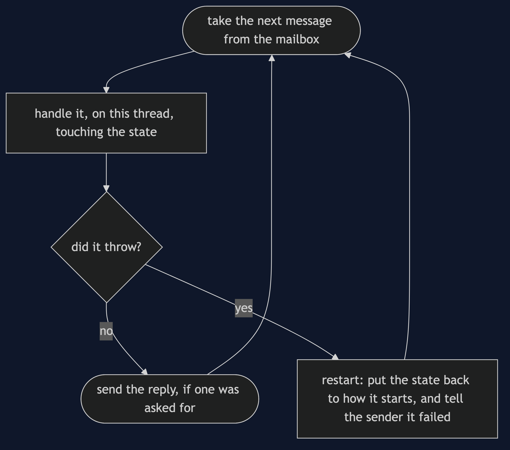
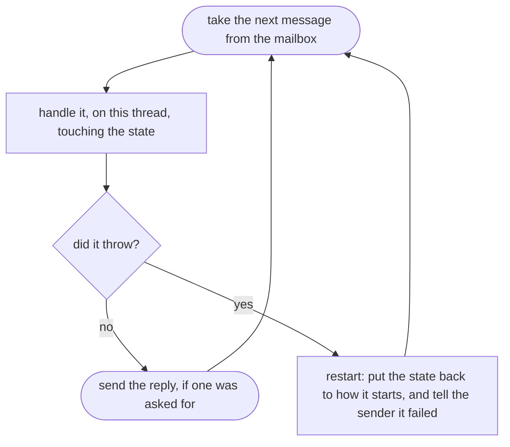

# Actor Pattern — Data Flow Diagram

What the actor does with each message.

Mermaid source

```mermaid
flowchart TD
    Take(["take the next message from the mailbox"])
    Handle["handle it, on this thread, touching the state"]
    Ok{"did it throw?"}
    Reply(["send the reply, if one was asked for"])
    Restart["restart: put the state back to how it starts, and tell the sender it failed"]
    Take --> Handle --> Ok
    Ok -- no --> Reply --> Take
    Ok -- yes --> Restart --> Take
```

