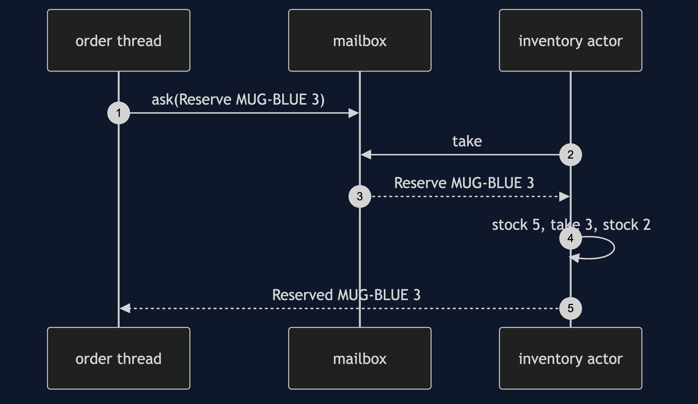
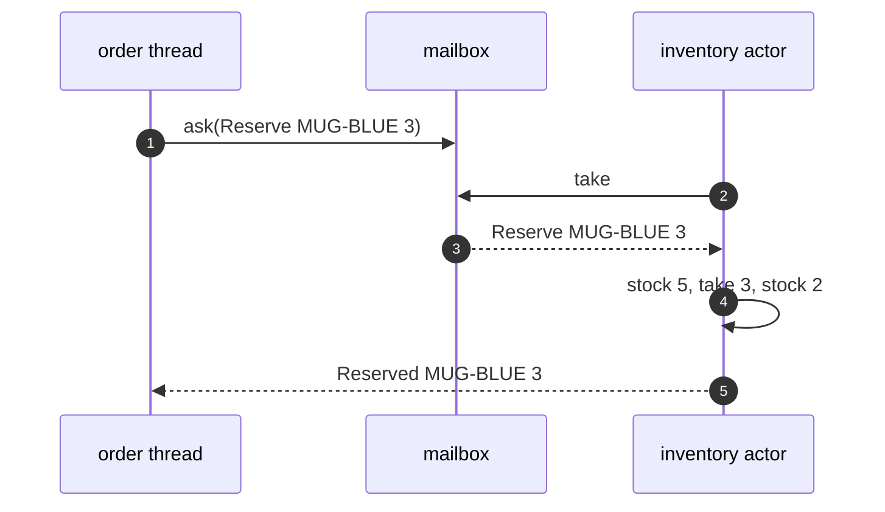

# Actor Pattern — Sequence Diagram

Written for a listener with the screen off.

Say it in words. An order thread asks the inventory actor to reserve three mugs. The message goes into the mailbox. The inventory actor takes it, works on its own private stock, finds enough, takes three away, and puts a reserved message in the reply. The order thread, which has been waiting on the promise of a reply, gets the reserved message. Meanwhile another thread's message sits in the mailbox, and is handled next. The stock was only ever touched by the inventory actor's thread.

Mermaid source

The load-bearing sentence: **the stock is touched only by the actor's own thread.**
