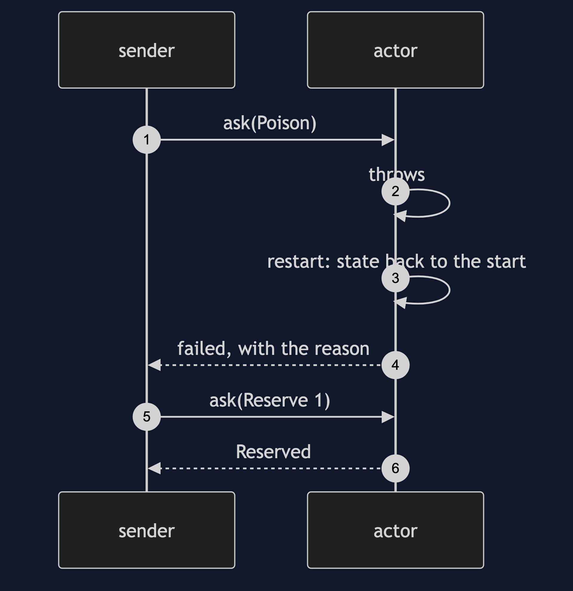
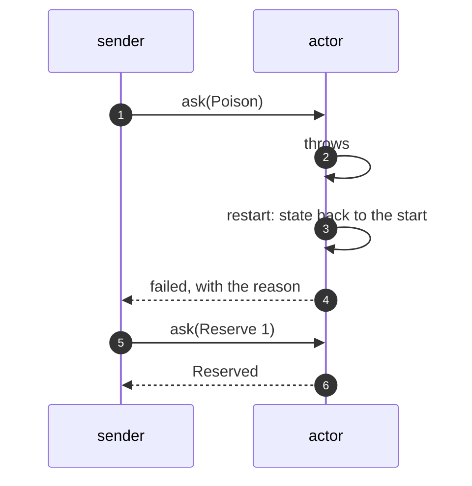

# Actor Pattern — UML Sequence Diagrams

Four sequences.

## 1. A Restart

Mermaid source

```mermaid
sequenceDiagram
    autonumber
    participant S as sender
    participant A as actor
    S->>A: ask(Poison)
    A->>A: throws
    A->>A: restart: state back to the start
    A-->>S: failed, with the reason
    S->>A: ask(Reserve 1)
    A-->>S: Reserved
```

