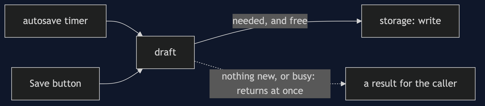
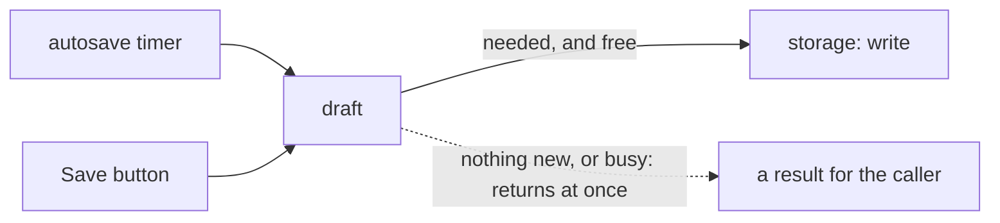

# Balking Pattern — Architecture Diagram

Callers ask; the draft decides whether to act.

Mermaid source

```mermaid
flowchart LR
    T["autosave timer"] --> D["draft"]
    B["Save button"] --> D
    D -->|needed, and free| S["storage: write"]
    D -.->|nothing new, or busy: returns at once| R["a result for the caller"]
```

