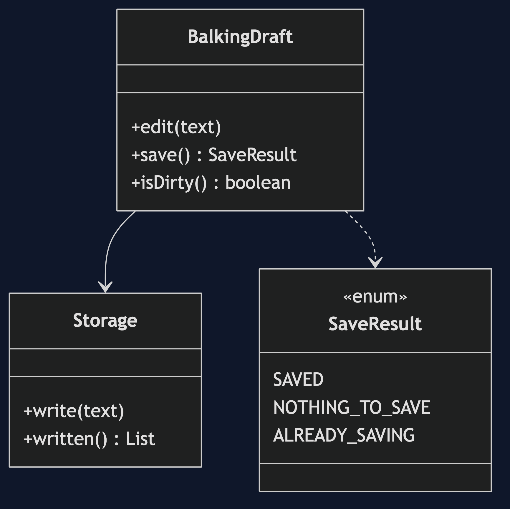
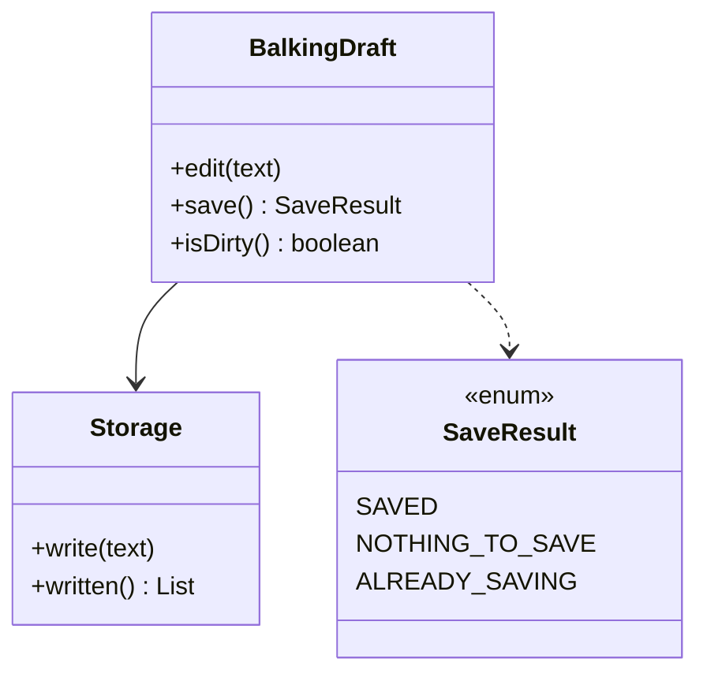

# Balking Pattern — Class Diagram

A draft that checks its state before it saves.

Mermaid source

```mermaid
classDiagram
    class BalkingDraft {
        +edit(text)
        +save() SaveResult
        +isDirty() boolean
    }
    class SaveResult {
        <<enum>>
        SAVED
        NOTHING_TO_SAVE
        ALREADY_SAVING
    }
    class Storage {
        +write(text)
        +written() List
    }
    BalkingDraft --> Storage
    BalkingDraft ..> SaveResult
```

