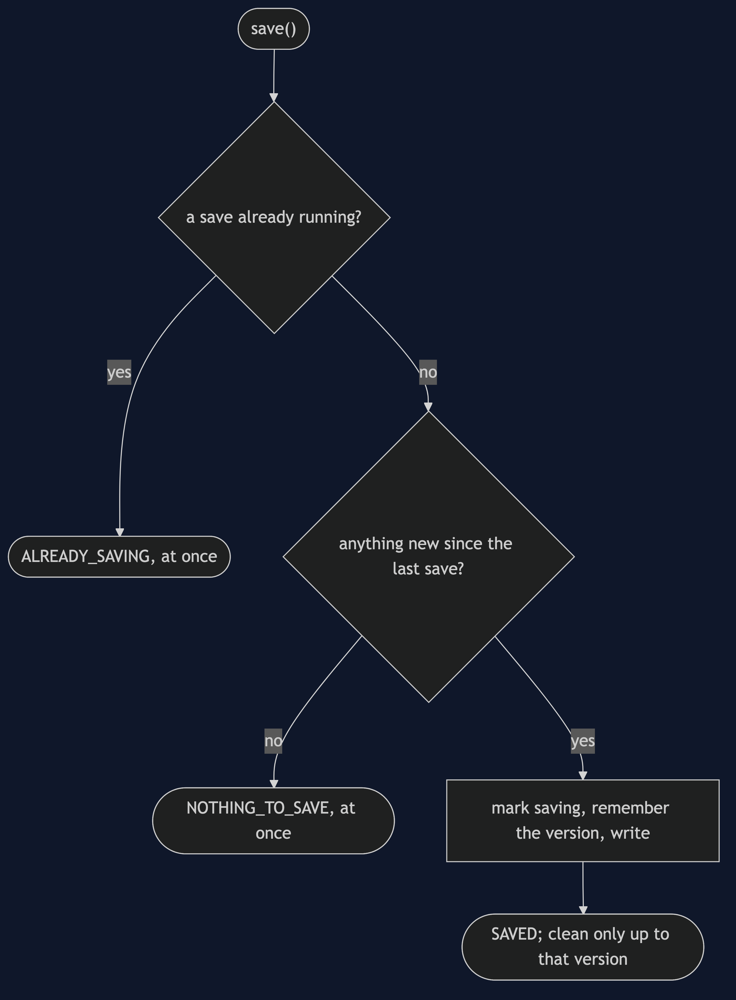
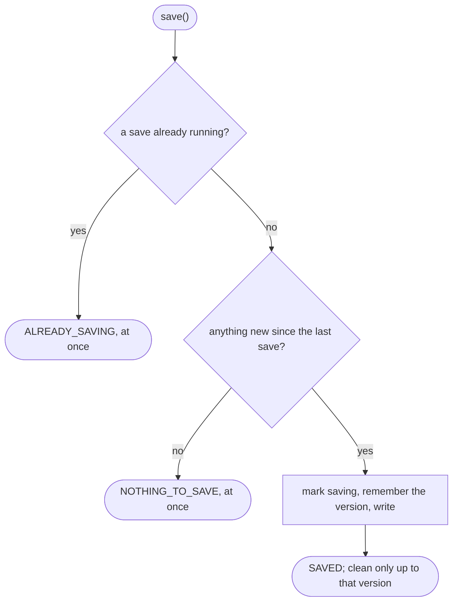

# Balking Pattern — Data Flow Diagram

What save does.

Mermaid source

```mermaid
flowchart TD
    Save(["save()"])
    Busy{"a save already running?"}
    B1(["ALREADY_SAVING, at once"])
    Clean{"anything new since the last save?"}
    B2(["NOTHING_TO_SAVE, at once"])
    Do["mark saving, remember the version, write"]
    Done(["SAVED; clean only up to that version"])
    Save --> Busy
    Busy -- yes --> B1
    Busy -- no --> Clean
    Clean -- no --> B2
    Clean -- yes --> Do --> Done
```

