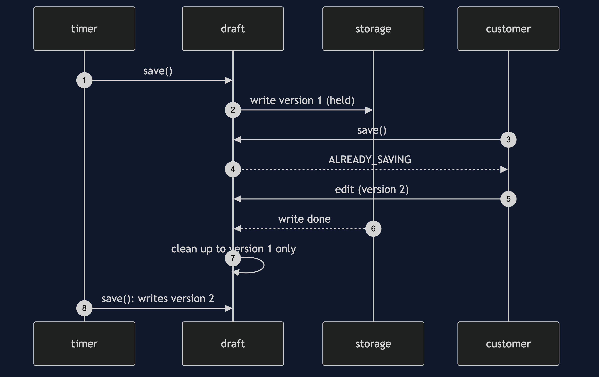
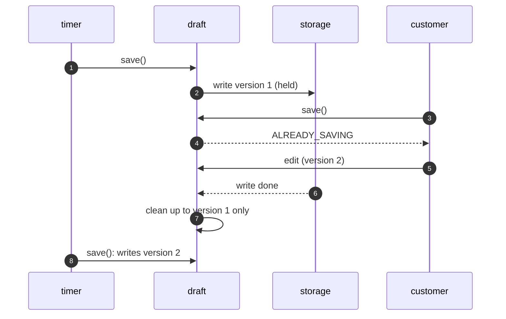

# Balking Pattern — Sequence Diagram

Written for a listener with the screen off.

Say it in words. The timer calls save. The draft has a new edit and no save running, so it records the version and starts writing. While the write is held, the customer clicks Save. The draft sees a save is running and returns already saving, at once. The customer edits again, and the version moves on. When the first write finishes, the draft marks clean only up to the version it saved, so it is still dirty, and the next save writes the new edit.

Mermaid source

The load-bearing sentence: **the version is what keeps the edit made during a save from being lost.**
