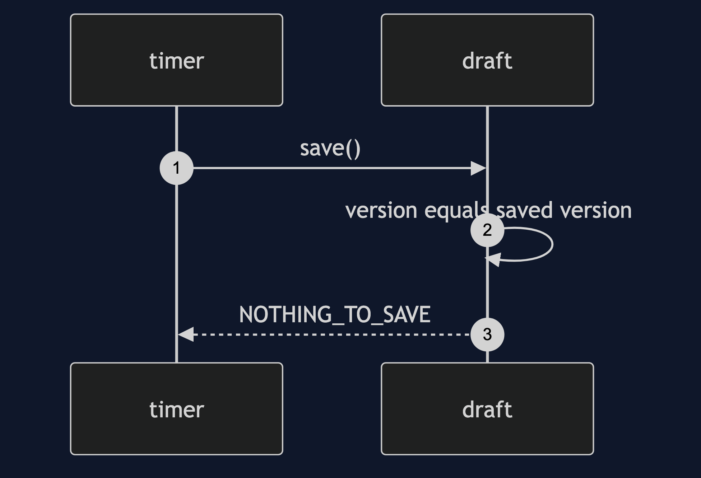
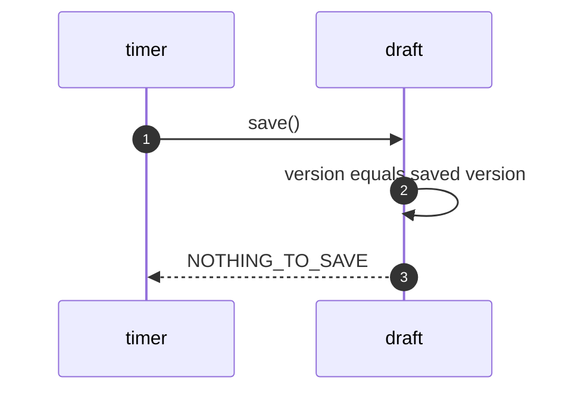

# Balking Pattern — UML Sequence Diagrams

Four sequences.

## 1. A Clean Balk

Mermaid source

```mermaid
sequenceDiagram
    autonumber
    participant T as timer
    participant D as draft
    T->>D: save()
    D->>D: version equals saved version
    D-->>T: NOTHING_TO_SAVE
```

