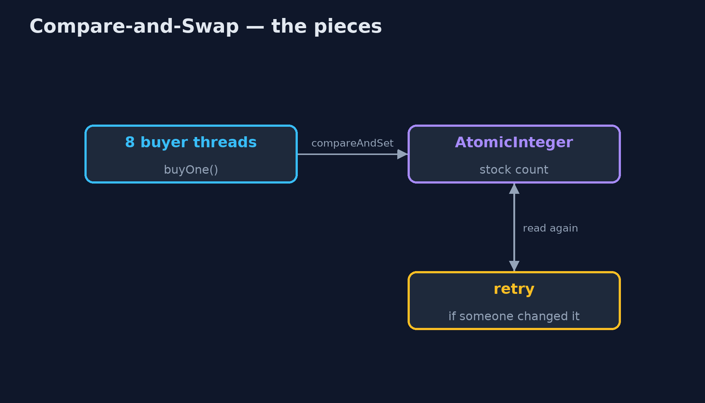

# Lock-Free Compare-and-Swap Pattern

```
src/main/java/com/jk/explore/cas/
├── CasStock.java            The pattern: read the value, work out the new one, and swap it in only if nobody changed it meanwhile; if they did, try again
├── CompareAndSwapDemo.java  The five acts: check-then-act, a lock, a compare-and-swap loop, the loop in one call, and the bill
├── FlashSale.java           A flash sale: many buyer threads, each trying to buy several kettles at once
├── LockedStock.java         Correct with a lock: only one buyer at a time may look and take
├── Stock.java               Something that sells kettles from a limited stock: returns true if a kettle was sold
└── UnsafeStock.java         Without the pattern: check, then act, with nothing stopping two buyers checking at the same moment
```

**Read a value, work out the new one, and swap it in only if nobody changed it in the meantime; if they did, read again and retry, with no lock at all.**

Compare-and-swap is the building block of lock-free programming. The
processor offers one indivisible instruction: "if this value is still what I
saw, replace it with this new value, and tell me whether it worked". A thread
reads the value, works out the new one, and tries the swap. If another thread
changed the value first, the swap fails and the thread simply reads again and
retries.

No thread ever waits for a lock. Java exposes it through `AtomicInteger`,
`AtomicLong`, `AtomicReference` and friends, with methods such as
`compareAndSet` and `updateAndGet`.

## The idea in everyday terms

Think of booking a seat for a concert online. You look at the seat map and
pick seat 12. When you press "book", the system books it only if seat 12 is
still free at that moment. If someone else booked it while you were
deciding, it says so, and you look at the map again and pick another.
Nobody is ever locked out of the map while someone else decides.

## The scenario

The online store runs a flash sale: 100 kettles, and eight buyer threads each
trying to buy fifty. The stock check read the count, ran a quick fraud check,
and then wrote back the count minus one. Two buyers could read the same count
at the same moment, and the shop sold more kettles than it had.

## Run

```bash
./gradlew run
```

The demo tells the story in 5 acts, each printing exact numbers that the tests check:

| Act | What it shows |
| --- | --- |
| 1. Check, then act | 8 buyers, 100 kettles, no protection: more than 100 kettles sold. |
| 2. A lock | With a lock, exactly 100 are sold and 0 are left, but every other buyer waits in line. |
| 3. Compare-and-swap | A compareAndSet loop sells exactly 100 with no locks; a buyer who lost a race just looked again. |
| 4. The loop in one call | getAndUpdate(s -> s > 0 ? s - 1 : s) sells 100 and leaves 0. |
| 5. The bill | Take a kettle, then stop before recording the buyer: stock 99, buyers 0. Two atomic values are not one atomic change. |

## Test

```bash
./gradlew test
```

7 tests in `DemoRunsTest`, `StockTest`. Every number the demo prints is asserted, and nothing depends on the clock, so every run gives the same result.

## Technologies and versions

| Technology | Version | Used for |
| --- | --- | --- |
| Java | 21 | the code (toolchain set in `build.gradle`) |
| Gradle | 9.2.1 (wrapper) | build and run, nothing to install |
| JUnit | 5.10.2 | the tests |
| videokit | repository tool | the narrated video and animation: Piper `en_US-amy-medium`, speed 0.8, longer pauses (the approved `amy-slow` voice) |

## Learning Material

| Document | What it is for |
| --- | --- |
| [Problem statement](docs/problem-statement.md) | the situation and what the project must show |
| [Prerequisites](docs/prerequisites.md) | what you need to know first |
| [Lock-Free Compare-and-Swap, explained](docs/compare-and-swap-pattern-explained.md) | the acts in prose |
| [Session guide](docs/session.md) | a one-hour lesson with exercises |
| [Animated walkthrough](docs/animation.html) | the acts step by step, narrated |
| [Spec](docs/spec.md) | what this project must be true of |

### The pattern in one picture

Many buyers, one atomic stock count.



### Where each piece sits

Three ways to sell from one stock.


### How the data moves

The second swap fails, so the second buyer reads again.


### Who calls whom, in order

Read, check, swap if unchanged.


### Video

`video/compare-and-swap-pattern-explained.mp4` (with `.m4a` audio and `.srt` subtitles) is built by `video/build_video.sh`. Rendered media is not committed.

## What it costs

- **One value at a time.** Taking a kettle and recording the buyer are two atomic changes, not one; a thread that stops between them leaves stock 99 and no buyer recorded.
- **Spinning under contention.** When many threads fight over one value, they retry again and again, using the processor instead of waiting quietly.
- **Subtle bugs.** Lock-free code beyond a single counter is hard to get right; the classic trap is the ABA problem.

## When this is too much

When a change touches several values that must stay consistent, use a lock or
a transaction. And when contention is very high on a counter, `LongAdder`
spreads the updates out and is faster than a single atomic value.

## Where you have already met this

- `AtomicInteger.incrementAndGet`, `compareAndSet`, `updateAndGet`.
- `ConcurrentHashMap` and `ConcurrentLinkedQueue`, built on compare-and-swap.
- Optimistic locking in databases: `UPDATE ... WHERE version = 7`.
- Git's refusal to push when the remote branch moved since you last pulled.

## Where this sits

This project is in [concurrency-design-patterns](..), next to
[Monitor Object](../monitor-object-pattern), the lock-based way to protect
shared state, and [Double-Checked Locking](../double-checked-locking-pattern).
