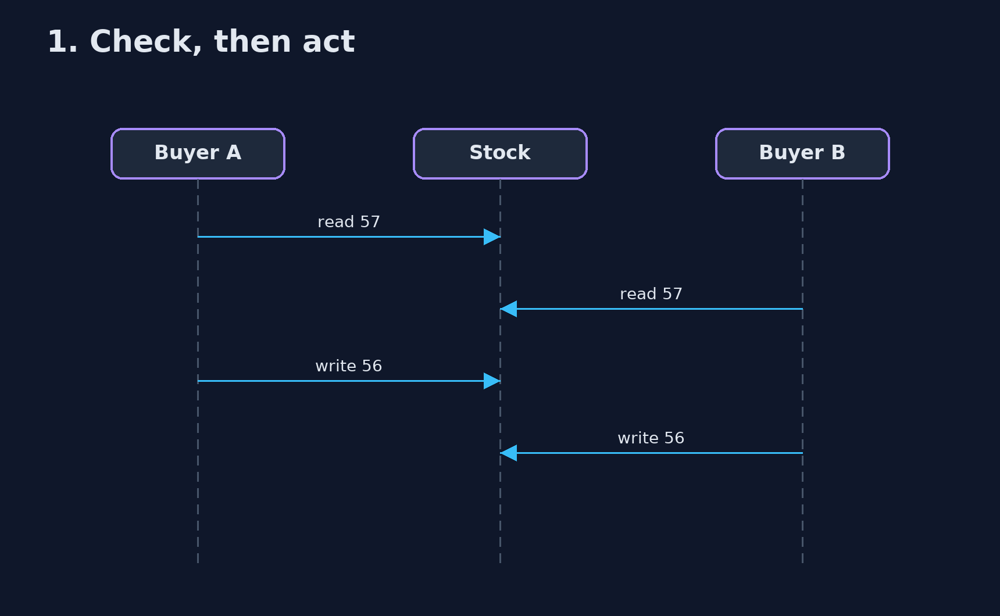
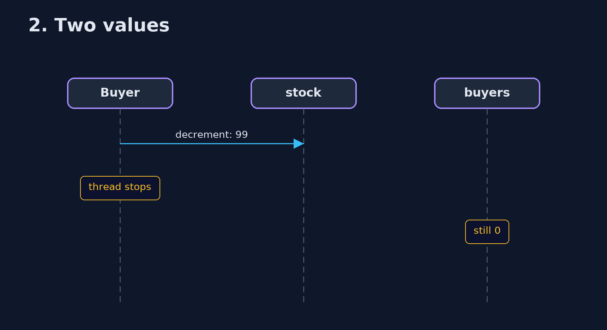

# Lock-Free Compare-and-Swap Pattern — UML Sequence Diagrams

## 1. 1. Check, then act

Both write the same value; two kettles leave, one is counted.

## 2. 2. Two values

Each change is atomic; the pair is not.

