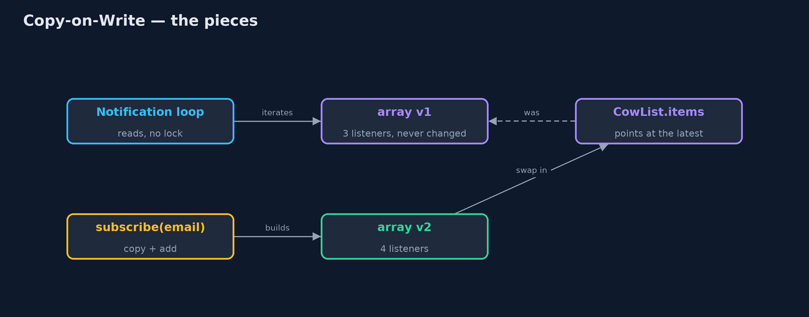
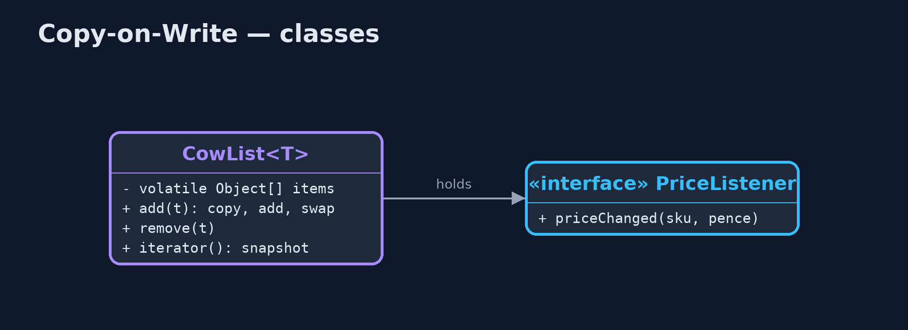
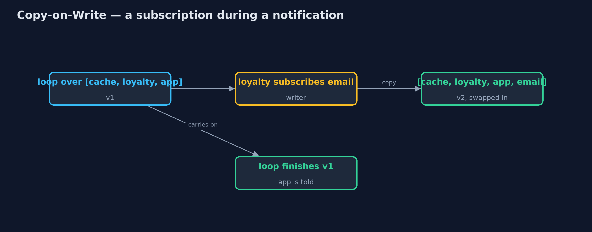
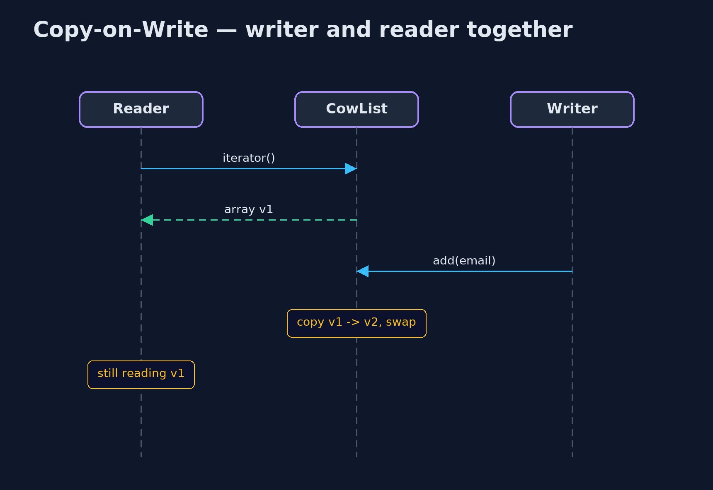

# Copy-on-Write Pattern

```
src/main/java/com/jk/explore/copyonwrite/
├── CopyOnWriteDemo.java  The five acts: a plain list changed while being read, a copy-on-write list, readers with no locks, snapshots, and the bill
├── CowList.java          The pattern, written out: readers use the current array with no lock; a writer copies it, changes the copy, and swaps it in
└── PriceListener.java    Something that wants to hear when a product's price changes: the web page cache, the app, the email service
```

**Let readers use the current copy with no locks at all, and make every writer copy the whole thing, change the copy, and swap it in.**

Copy-on-Write is a concurrency pattern for data that is read far more often
than it changes. Readers use the current version directly, with no locks. A
writer never changes that version: it copies it, changes the copy, and
replaces the current version with the copy in one step. A reader half way
through the old version carries on undisturbed, and the next reader sees the
new one.

Java's `CopyOnWriteArrayList` and `CopyOnWriteArraySet` work this way, and
they are the usual home for lists of listeners.

## The idea in everyday terms

Think of a restaurant's printed menus. Diners read them at their tables, as
long as they like. To change a dish, the manager does not cross it out on the
menus in people's hands; they print a whole new batch and swap them in at the
door. Diners already reading finish with the old menu; new diners get the new
one. Reprinting for every small change is expensive, so it suits menus that
rarely change.

## The scenario

When a product's price changes, the online store tells a list of listeners:
the web page cache, the loyalty service, the phone app. Prices change
constantly; the list of listeners rarely does. The list was a plain
`ArrayList`, and when the loyalty service subscribed the email service while
being told about a price change, the notification loop crashed half way.

## Run

```bash
./gradlew run
```

The demo tells the story in 5 acts, each printing exact numbers that the tests check:

| Act | What it shows |
| --- | --- |
| 1. A plain list, changed while read | The loyalty service subscribes the email service mid-notification: ConcurrentModificationException; the phone app never hears. |
| 2. A copy-on-write list | The same thing with a copy-on-write list: all 3 listeners hear the first change, all 4 hear the next. |
| 3. Readers never lock | 100,000 notification passes while another thread subscribes and unsubscribes 1,000 times: 0 failures, 0 reader locks. |
| 4. Snapshots | A reader started with 3 listeners; a fourth was added; the reader finishes with 3. |
| 5. The bill | Adding 10,000 listeners one at a time copies 49,995,000 references. |

## Test

```bash
./gradlew test
```

7 tests in `CowListTest`, `DemoRunsTest`. Every number the demo prints is asserted, and nothing depends on the clock, so every run gives the same result.

## Technologies and versions

| Technology | Version | Used for |
| --- | --- | --- |
| Java | 21 | the code (toolchain set in `build.gradle`) |
| Gradle | 9.2.1 (wrapper) | build and run, nothing to install |
| JUnit | 5.10.2 | the tests |
| videokit | repository tool | the narrated video and animation: Piper `en_US-amy-medium`, speed 0.8, longer pauses (the approved `amy-slow` voice) |

## Learning Material

| Document | What it is for |
| --- | --- |
| [Problem statement](docs/problem-statement.md) | the situation and what the project must show |
| [Prerequisites](docs/prerequisites.md) | what you need to know first |
| [Copy-on-Write, explained](docs/copy-on-write-pattern-explained.md) | the acts in prose |
| [Session guide](docs/session.md) | a one-hour lesson with exercises |
| [Animated walkthrough](docs/animation.html) | the acts step by step, narrated |
| [Spec](docs/spec.md) | what this project must be true of |

### The pattern in one picture

Readers read the current array; a writer builds the next one.



### Where each piece sits

A volatile array, copied by writers.



### How the data moves

The loop never sees a half-changed list.



### Who calls whom, in order

Neither waits for the other.



### Video

`video/copy-on-write-pattern-explained.mp4` (with `.m4a` audio and `.srt` subtitles) is built by `video/build_video.sh`. Rendered media is not committed.

## What it costs

- **Every write copies everything.** Adding 10,000 listeners one by one copied almost 50 million references.
- **Readers may see an old version.** A reader that started before a change finishes with the old list.
- **Writers wait for each other.** Writes are serialised by a lock.

## When this is too much

For data that changes often, such as a shopping basket or an order queue,
copying on every write is far too costly: use a concurrent collection or a
lock instead. Copy-on-write is for small collections that are read constantly
and changed rarely.

## Where you have already met this

- `java.util.concurrent.CopyOnWriteArrayList` and `CopyOnWriteArraySet`.
- Listener and observer lists in Swing, Spring and many libraries.
- Linux's `fork()`, which shares memory between processes until one writes to it.
- Snapshots in file systems such as ZFS and Btrfs.

## Where this sits

This project is in [concurrency-design-patterns](..), next to
[Read-Write Lock](../read-write-lock-pattern), which also favours readers but
makes them take a lock, and near
[Immutable Object](../../foundational-design-patterns/immutable-object-pattern),
the idea copy-on-write is built on.
